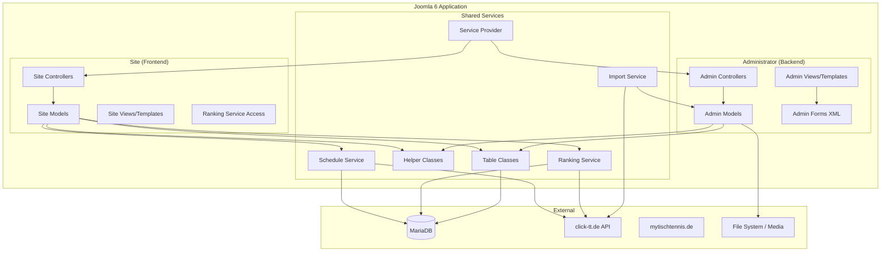
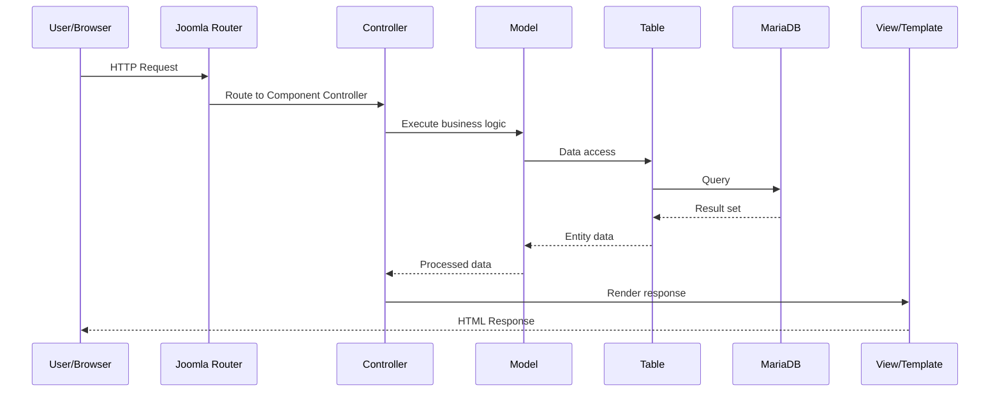
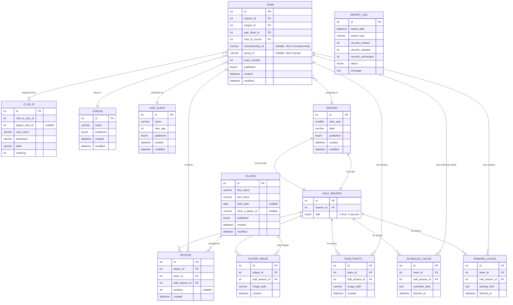

# Design Document

## Overview

The Table Tennis Club Manager (`com_ttclub`) is a Joomla 6 component that provides a complete management solution for table tennis clubs. It follows Joomla's MVC architecture with separate administrator (backend) and site (frontend) sections.

The component manages core entities: Players, Teams, Leagues, Seasons (with half-seasons), and Age Classes. Team rosters bind players to teams per half-season, enabling roster changes between halves. Each roster entry can carry an optional position number. A data import subsystem fetches data from click-tt.de using its structured API endpoints (`clubPools`, `clubPortraitTT`, `clubTeams`) and import via scraping from a web page. Multiple click-tt.de club IDs are supported to handle different registrations (e.g., adult teams vs. youth game associations). Seasons support an optional label for parallel competitions (e.g., cup/Pokal) alongside the main league season. A ranking service fetches and caches league standings from click-tt.de for frontend display. A schedule service fetches and caches match schedule data from click-tt.de for team detail pages (no local schedule storage).

**Key design decisions:**
- Component name: `com_ttclub` (short, Joomla convention-compliant)
- Vendor namespace: `Fatherjoe\Component\Ttclub`
- Database engine: MariaDB with Joomla's database abstraction layer
- PHP 8.4+ with strict typing throughout
- PSR-4 autoloading for all classes
- Joomla's native form framework for validation and CSRF protection
- Image storage in Joomla's media folder with half-season associations
- Half-season resolution by calendar month (Aug–Dec = first half, Jan–Jul = second half)
- click-tt.de as primary external data source via URL pattern `https://{federation}.click-tt.de/cgi-bin/WebObjects/nuLigaTTDE.woa/wa/{action}?club={clubId}` (federation is per-club entry, not global)
- Ranking data cached with configurable TTL (default 3 days)
- Schedule data fetched live from click-tt.de and cached for 3 days (no local schedule storage)

## Architecture

### High-Level Architecture



### Component Directory Structure

```
com_ttclub/
├── administrator/
│   ├── access.xml                # ACL permission definitions
│   ├── config.xml                # Component configuration form
│   ├── forms/                    # XML form definitions
│   │   ├── player.xml
│   │   ├── team.xml
│   │   ├── league.xml
│   │   ├── season.xml
│   │   ├── roster.xml
│   │   ├── ageclass.xml
│   │   ├── import.xml
│   │   └── clubid.xml
│   ├── services/
│   │   └── provider.php          # DI service provider
│   ├── sql/
│   │   ├── install.sql           # Initial schema
│   │   ├── uninstall.sql         # Cleanup
│   │   └── updates/              # Versioned schema updates
│   │       └── mariadb/
│   ├── src/
│   │   ├── Controller/
│   │   │   ├── DisplayController.php
│   │   │   ├── PlayerController.php
│   │   │   ├── PlayersController.php
│   │   │   ├── TeamController.php
│   │   │   ├── TeamsController.php
│   │   │   ├── LeagueController.php
│   │   │   ├── LeaguesController.php
│   │   │   ├── SeasonController.php
│   │   │   ├── SeasonsController.php
│   │   │   ├── RosterController.php
│   │   │   ├── AgeclassController.php
│   │   │   ├── AgeclassesController.php
│   │   │   ├── ClubIdController.php
│   │   │   ├── ClubIdsController.php
│   │   │   ├── ImportController.php
│   │   │   └── HistoricalImportController.php
│   │   ├── Extension/
│   │   │   └── TtclubComponent.php
│   │   ├── Helper/
│   │   │   └── TtclubHelper.php
│   │   ├── Model/
│   │   │   ├── PlayerModel.php / PlayersModel.php
│   │   │   ├── TeamModel.php / TeamsModel.php
│   │   │   ├── LeagueModel.php / LeaguesModel.php
│   │   │   ├── SeasonModel.php / SeasonsModel.php
│   │   │   ├── RosterModel.php
│   │   │   ├── AgeclassModel.php / AgeclassesModel.php
│   │   │   ├── ClubIdModel.php / ClubIdsModel.php
│   │   │   └── ImportModel.php
│   │   ├── Service/
│   │   │   ├── ImportService.php
│   │   │   ├── ClickTtUrlBuilder.php
│   │   │   ├── ClickTtParser.php
│   │   │   ├── RankingService.php
│   │   │   ├── ScheduleService.php
│   │   │   ├── HalfSeasonResolver.php
│   │   │   ├── HistoricalImportService.php
│   │   │   ├── SeasonParserInterface.php
│   │   │   ├── MyTischtennisParser.php
│   │   │   ├── DiscoveredSeason.php
│   │   │   ├── SeasonImportResult.php
│   │   │   └── HistoricalImportResult.php
│   │   ├── Table/
│   │   │   ├── PlayerTable.php
│   │   │   ├── TeamTable.php
│   │   │   ├── LeagueTable.php
│   │   │   ├── SeasonTable.php
│   │   │   ├── HalfSeasonTable.php
│   │   │   ├── RosterTable.php
│   │   │   ├── AgeclassTable.php
│   │   │   ├── ClubIdTable.php
│   │   │   ├── RankingCacheTable.php
│   │   │   ├── ScheduleCacheTable.php
│   │   │   └── ImportLogTable.php
│   │   └── View/
│   │       ├── Players/     HtmlView.php
│   │       ├── Player/      HtmlView.php
│   │       ├── Teams/       HtmlView.php
│   │       ├── Team/        HtmlView.php
│   │       ├── Leagues/     HtmlView.php
│   │       ├── League/      HtmlView.php
│   │       ├── Seasons/     HtmlView.php
│   │       ├── Season/      HtmlView.php
│   │       ├── Ageclasses/  HtmlView.php
│   │       ├── Ageclass/    HtmlView.php
│   │       ├── Clubids/     HtmlView.php
│   │       ├── Clubid/      HtmlView.php
│   │       ├── Roster/      HtmlView.php
│   │       └── Import/      HtmlView.php
│   └── tmpl/                     # Admin view templates
├── site/
│   ├── src/
│   │   ├── Controller/
│   │   │   └── DisplayController.php
│   │   ├── Model/
│   │   │   ├── PlayersModel.php
│   │   │   ├── PlayerModel.php
│   │   │   ├── TeamsModel.php
│   │   │   ├── TeamModel.php
│   │   │   └── SeasonsModel.php
│   │   └── View/
│   │       ├── Players/     HtmlView.php
│   │       ├── Player/      HtmlView.php
│   │       ├── Teams/       HtmlView.php
│   │       └── Team/        HtmlView.php
│   └── tmpl/
├── media/
│   └── com_ttclub/
│       ├── css/
│       ├── js/
│       └── images/
│           └── placeholder.png
└── ttclub.xml                    # Installation manifest
```

### Request Flow



## Components and Interfaces

### Service Provider

The component registers with Joomla's DI container via `administrator/services/provider.php`:

```php
<?php
declare(strict_types=1);

use Joomla\CMS\Dispatcher\ComponentDispatcherFactoryInterface;
use Joomla\CMS\Extension\ComponentInterface;
use Joomla\CMS\Extension\Service\Provider\ComponentDispatcherFactory;
use Joomla\CMS\Extension\Service\Provider\MVCFactory;
use Joomla\CMS\MVC\Factory\MVCFactoryInterface;
use Joomla\DI\Container;
use Joomla\DI\ServiceProviderInterface;
use Fatherjoe\Component\Ttclub\Administrator\Extension\TtclubComponent;

return new class implements ServiceProviderInterface {
    public function register(Container $container): void
    {
        $container->registerServiceProvider(new MVCFactory('\\Fatherjoe\\Component\\Ttclub'));
        $container->registerServiceProvider(new ComponentDispatcherFactory('\\Fatherjoe\\Component\\Ttclub'));

        $container->set(
            ComponentInterface::class,
            function (Container $container): TtclubComponent {
                $component = new TtclubComponent($container->get(ComponentDispatcherFactoryInterface::class));
                $component->setMVCFactory($container->get(MVCFactoryInterface::class));
                return $component;
            }
        );
    }
};
```

### Key Interfaces

| Interface | Purpose |
|-----------|---------|
| `ComponentInterface` | Main component registration with Joomla |
| `MVCFactoryInterface` | Creates MVC objects (Models, Views, Controllers, Tables) |
| `FormFactoryInterface` | Creates form objects for validation |
| `RouterServiceInterface` | SEF URL routing for frontend |
| `BootableExtensionInterface` | Component initialization hook |

### Controller Layer

**Singular controllers** (e.g., `PlayerController`) handle single-record CRUD (save, delete, cancel). They extend `Joomla\CMS\MVC\Controller\FormController`.

**Plural controllers** (e.g., `PlayersController`) handle list operations (publish, unpublish, ordering, batch). They extend `Joomla\CMS\MVC\Controller\AdminController`.

**Special controllers:**
- `ImportController` — orchestrates the import workflow from click-tt.de (iterating over all configured club IDs)
- `HistoricalImportController` — orchestrates the one-time bulk historical import, including the existing-data warning gate and data source selection
- `RosterController` — handles roster assignment/removal and copy operations
- `ClubIdController` / `ClubIdsController` — manages club ID entries (add, edit, remove) with dedicated backend form (Req 1.5, 1.7). The list view displays click-tt.de club IDs for each entry (Req 1.10)

### Model Layer

**List models** (e.g., `PlayersModel`) extend `Joomla\CMS\MVC\Model\ListModel`:
- Provide paginated, sortable, filterable lists
- Implement `getListQuery()` for database queries
- Support search/filter state via user state
- `LeaguesModel` includes a subquery count of teams per league for display (Req 3.2)
- `PlayersModel` supports search/filter by last name (Req 7.9)

**Item models** (e.g., `PlayerModel`) extend `Joomla\CMS\MVC\Model\AdminModel`:
- Handle single-record load, validate, save
- Implement `getForm()` to return Joomla Form objects
- Enforce business rules in `save()` override

**Site models** extend `Joomla\CMS\MVC\Model\BaseDatabaseModel` or `ListModel`:
- Read-only access for public display
- Include half-season resolution logic (calendar-month based)
- `TeamModel` fetches ranking data via `RankingService` and schedule data via `ScheduleService` for the team detail page (Req 13, 14)
- `TeamsModel` resolves the current half-season and supports season navigation including parallel seasons (Req 12.3, 2.15)
- `PlayersModel` filters players by visibility settings and resolves current half-season for images (Req 11)

### Import Service

The `ImportService` fetches data from click-tt.de using a multi-step discovery and scraping flow:

#### Import Flow Overview

1. **Roster Discovery & Import**: Fetch `clubPools` overview to discover seasons, then import rosters with "X.Y" position notation
2. **League Resolution via clubMeetings**: POST to `clubMeetings` to get all matches and extract championship_id + group_id per team (used for live ranking/schedule fetching, NOT stored as local schedule records)
3. **League Name Fetch**: For each team, fetch `groupPage?championship={id}&group={id}` and parse the second line of the `<h1>` heading for the full league name (e.g., "Erwachsene Kreisliga Staffel 1")
4. **Priority Selection**: When a team appears in multiple championships, select the highest-priority one: VOL/VSK (Verband) > SK (Spielklassen/Bezirk) > Pokal (Cup)
5. **Store championship_id and group_id** on the team record for later use (ranking table display, schedule links)

#### Step-by-Step URL Flow

```
Step 1: Discover seasons and import rosters
  GET https://{federation}.click-tt.de/cgi-bin/WebObjects/nuLigaTTDE.woa/wa/clubPools?club={club_id}
  → Parse season links with displayTyp=vorrunde|rueckrunde and seasonName
  → For each season/half: fetch roster page, parse "X.Y" positions, create players + roster entries + teams (with "Unbekannt" league initially)

Step 2: Resolve league names — POST to clubMeetings for each season
  POST https://{federation}.click-tt.de/cgi-bin/WebObjects/nuLigaTTDE.woa/wa/clubMeetings
  Body (form-encoded):
    searchTimeRange=13-6976
    searchType=1
    searchTimeRangeFrom=01.08.{startYear}
    searchTimeRangeTo=31.07.{startYear+1}
    selectedTeamId=WONoSelectionString
    club={club_id}
    searchMeetings=Suchen
  → Returns HTML table with all matches for the season
  
  Table columns (0-indexed):
    0: Tag (day of week)
    1: Datum (date, e.g. "14.09.2025")
    2: Zeit (time)
    3: Spiellokal (venue)
    4: Nr. (match number)
    5: Liga (league short name)
    6: Heimmannschaft (home team)
    7: Gastmannschaft (away team)
    8: Spiele/result

  From match report links in each row extract:
    - championship_id (e.g., "SK+Bz.+KA+25%2F26")
    - group_id (e.g., "499592")
  Link pattern: /wa/clubMeetingReport?meeting={id}&championship={championship_id}&club={club_id}&group={group_id}

Step 3: For each team, select best championship by priority
  VOL/VSK (starts with "VOL" or "VSK") → priority 1 (Verband level)
  SK (starts with "SK") → priority 2 (Bezirk level)
  Pokal (contains "pokal") → priority 3 (Cup)
  Other → priority 4

Step 4: Fetch full league name from groupPage
  GET https://{federation}.click-tt.de/cgi-bin/WebObjects/nuLigaTTDE.woa/wa/groupPage?championship={championship_id}&group={group_id}
  → Parse <h1> element, split by <br> tags:
    Line 1: Championship name (e.g., "Spielklassen Bezirk Karlsruhe 2025/26")
    Line 2: League name (e.g., "Erwachsene Kreisliga Staffel 1") ← THIS IS WHAT WE WANT
    Line 3: "Tabelle und Spielplan (Aktuell)"
  → Store league name + update team's championship_id and group_id fields (used by RankingService and ScheduleService for live data fetching)

Step 5 (optional): Resolve click-tt club ID from BaTTV ID
  GET https://{federation}.click-tt.de/cgi-bin/WebObjects/ClickTTVBW.woa/wa/clubSearch?federation={federation}&searchFor={battv_id}
  → Find link "Spielbetrieb und Ergebnisse" → extract club={club_id}
  (Used for parallel season imports via URL)
```

#### Import Service Class

```php
<?php
declare(strict_types=1);

namespace Fatherjoe\Component\Ttclub\Administrator\Service;

class ImportService
{
    private ClickTtUrlBuilder $urlBuilder;
    private ClickTtParser $parser;
    private HttpClientInterface $httpClient;

    /**
     * Resolve the click-tt internal club ID from the BaTTV (federation) club ID.
     * Fetches the clubSearch page and extracts the club= parameter from the
     * "Spielbetrieb und Ergebnisse" link.
     *
     * @param string $federation Federation abbreviation (e.g., "BaTTV")
     * @param int $battvId The federation-specific club ID (e.g., 445)
     * @return int The click-tt internal club ID (e.g., 6658)
     */
    public function resolveClickTtClubId(string $federation, int $battvId): int;

    /**
     * Fetch all matches for a club in a given season by POSTing to clubMeetings.
     * Date range: 01.08.{startYear} to 31.07.{startYear+1}
     *
     * @return MatchListResult Contains parsed team/league/championship data
     */
    public function fetchClubMeetings(string $federation, int $clickTtClubId, int $startYear): MatchListResult;

    /**
     * Import rosters from clubPools endpoint.
     * Parses player positions from "X.Y" notation (X=team number, Y=position).
     */
    public function importRosters(int $clubIdConfigId, int $seasonId, int $halfSeasonId): ImportResult;

    /**
     * Execute a full import across all configured club IDs.
     * Flow: resolveClickTtClubId → fetchClubMeetings → parse teams/leagues → importRosters
     * Auto-creates missing seasons/half-seasons.
     * Creates separate parallel seasons with label (e.g., "Pokal") for cup competitions
     * identified by championship name via ClickTtParser::isCupCompetition().
     * Stores championship_id and group_id on team records for live ranking/schedule fetching.
     * Does NOT create local schedule records — schedule data is fetched live via ScheduleService.
     */
    public function executeFullImport(): FullImportResult;

    /**
     * Import a parallel season from a provided click-tt.de URL.
     * Parses the URL, derives the season label from the championship name,
     * and imports teams/rosters into the parallel season.
     * Does NOT create local schedule records — schedule data is fetched live via ScheduleService.
     */
    public function importFromUrl(string $clickTtUrl): ImportResult;

    /**
     * Validate connection to click-tt.de for a given club ID configuration.
     */
    public function validateClubConnection(int $clubIdConfigId): bool;
}
```

#### MatchListResult DTO

```php
<?php
declare(strict_types=1);

namespace Fatherjoe\Component\Ttclub\Administrator\Service;

class MatchListResult
{
    public function __construct(
        /** @var TeamMatchData[] */
        public readonly array $teams,
        public readonly int $totalMatches
    ) {}
}

class TeamMatchData
{
    public function __construct(
        public readonly string $teamName,         // e.g., "TTC Wöschbach II"
        public readonly string $leagueName,       // e.g., "E Kr Li"
        public readonly string $championshipId,   // e.g., "SK+Bz.+KA+25%2F26"
        public readonly string $groupId,          // e.g., "499592"
        /** @var MatchEntry[] */
        public readonly array $matches
    ) {}
}
```

### Click-TT URL Builder

```php
<?php
declare(strict_types=1);

namespace Fatherjoe\Component\Ttclub\Administrator\Service;

/**
 * Constructs URLs for click-tt.de endpoints.
 * The federation is passed per-call (sourced from the club entry's federation field).
 */
class ClickTtUrlBuilder
{
    /**
     * Build the club search URL to resolve BaTTV ID → click-tt club ID.
     * Pattern: https://{federation}.click-tt.de/cgi-bin/WebObjects/ClickTTVBW.woa/wa/clubSearch?federation={federation}&searchFor={battvId}
     */
    public function clubSearch(string $federation, int $battvId): string
    {
        return sprintf(
            'https://%s.click-tt.de/cgi-bin/WebObjects/ClickTTVBW.woa/wa/clubSearch?federation=%s&searchFor=%d',
            $federation,
            $federation,
            $battvId
        );
    }

    /**
     * Build the club meetings endpoint URL (POST target).
     * Pattern: https://{federation}.click-tt.de/cgi-bin/WebObjects/nuLigaTTDE.woa/wa/clubMeetings
     */
    public function clubMeetings(string $federation): string
    {
        return sprintf(
            'https://%s.click-tt.de/cgi-bin/WebObjects/nuLigaTTDE.woa/wa/clubMeetings',
            $federation
        );
    }

    /**
     * Build the POST body for clubMeetings request.
     *
     * @param int $clickTtClubId The resolved click-tt internal club ID
     * @param int $startYear Season start year (date range: 01.08.{startYear} to 31.07.{startYear+1})
     */
    public function clubMeetingsBody(int $clickTtClubId, int $startYear): string
    {
        return http_build_query([
            'searchTimeRange' => '13-6976',
            'searchType' => '1',
            'searchTimeRangeFrom' => sprintf('01.08.%d', $startYear),
            'searchTimeRangeTo' => sprintf('31.07.%d', $startYear + 1),
            'selectedTeamId' => 'WONoSelectionString',
            'club' => $clickTtClubId,
            'searchMeetings' => 'Suchen',
        ]);
    }

    /**
     * Build URL for nuLigaTTDE actions (clubPools, clubPortraitTT, clubTeams, etc.)
     * Pattern: https://{federation}.click-tt.de/cgi-bin/WebObjects/nuLigaTTDE.woa/wa/{action}?club={clubId}
     */
    public function buildUrl(string $federation, string $action, int $clubId, array $extraParams = []): string
    {
        $base = sprintf(
            'https://%s.click-tt.de/cgi-bin/WebObjects/nuLigaTTDE.woa/wa/%s?club=%d',
            $federation,
            $action,
            $clubId
        );
        if ($extraParams) {
            $base .= '&' . http_build_query($extraParams);
        }
        return $base;
    }

    public function clubPools(string $federation, int $clubId, array $params = []): string
    {
        return $this->buildUrl($federation, 'clubPools', $clubId, $params);
    }

    public function clubPortraitTT(string $federation, int $clubId, array $params = []): string
    {
        return $this->buildUrl($federation, 'clubPortraitTT', $clubId, $params);
    }

    public function clubTeams(string $federation, int $clubId, array $params = []): string
    {
        return $this->buildUrl($federation, 'clubTeams', $clubId, $params);
    }
}
```

### Click-TT Parser

```php
<?php
declare(strict_types=1);

namespace Fatherjoe\Component\Ttclub\Administrator\Service;

/**
 * Parses HTML responses from click-tt.de endpoints.
 */
class ClickTtParser
{
    /**
     * Parse clubSearch response to extract the click-tt club ID.
     * Finds the link with text "Spielbetrieb und Ergebnisse" and extracts
     * the club= URL parameter value.
     *
     * @return int The resolved click-tt internal club ID
     * @throws \RuntimeException If the link or club parameter cannot be found
     */
    public function parseClubSearchResult(string $html): int;

    /**
     * Parse clubMeetings response to extract match table data.
     * Extracts for each match row:
     * - League name (e.g., "E Kr Li")
     * - Team name (e.g., "TTC Wöschbach II")
     * - championship_id from match report link (e.g., "SK+Bz.+KA+25%2F26")
     * - group ID from match report link (e.g., "499592")
     * - Match date, time, opponent, venue, home/away, result
     *
     * @return TeamMatchData[] Grouped by team
     */
    public function parseClubMeetings(string $html): array;

    /**
     * Parse clubPools response to discover available seasons.
     * Returns season descriptors (start year, half-season indicators).
     */
    public function parseSeasonOverview(string $html): array;

    /**
     * Parse clubPools roster page.
     * Extracts player names and position notation "X.Y".
     * X = team number, Y = position within team.
     */
    public function parseRoster(string $html): array;

    /**
     * Parse clubPortraitTT response for league assignments.
     */
    public function parseLeagueAssignments(string $html): array;

    /**
     * Parse clubTeams response for team listings.
     */
    public function parseTeams(string $html): array;

    /**
     * Parse position notation "X.Y" into team number and position.
     * @return array{teamNumber: int, position: int}
     */
    public function parsePositionNotation(string $notation): array;

    /**
     * Parse ranking table HTML for a team's league.
     */
    public function parseRankingTable(string $html): array;

    /**
     * Parse clubMeetings response to extract schedule entries for a specific team.
     * Filters the match table rows by team name and returns structured schedule data.
     *
     * @return array Schedule entries with date, time, home_team, guest_team, result
     */
    public function parseScheduleForTeam(string $html, string $teamName): array;

    /**
     * Determine if a championship name indicates a cup/Pokal competition.
     * Checks for keywords: "Pokal", "Cup", "Sommer-Team"
     */
    public function isCupCompetition(string $championshipName): bool;

    /**
     * Parse a click-tt.de URL to extract federation, club ID, and action parameters.
     * Supports both nuLigaTTDE and ClickTTVBW URL patterns.
     *
     * @return array{federation: string, clubId: int, action: string, params: array}
     * @throws \InvalidArgumentException If URL is not a valid click-tt.de URL
     */
    public function parseClickTtUrl(string $url): array;
}
```

### Ranking Service

```php
<?php
declare(strict_types=1);

namespace Fatherjoe\Component\Ttclub\Administrator\Service;

/**
 * Fetches and caches league ranking tables from click-tt.de.
 */
class RankingService
{
    private ClickTtUrlBuilder $urlBuilder;
    private int $cacheDurationSeconds;

    /**
     * Get ranking table for a team's league and half-season.
     * Returns cached data if available and not expired.
     * Fetches fresh data from click-tt.de if cache is expired or missing.
     * The own team is identified by matching the club name from the club_ids table
     * and highlighted with a CSS class in the generated HTML.
     *
     * @return array|null Ranking rows or null on fetch failure
     */
    public function getRanking(int $teamId, int $halfSeasonId): ?array;

    /**
     * Check if cached ranking data is still valid.
     */
    public function isCacheValid(int $teamId, int $halfSeasonId): bool;

    /**
     * Invalidate cached ranking for a team/half-season.
     */
    public function invalidateCache(int $teamId, int $halfSeasonId): void;
}
```

### Schedule Service

```php
<?php
declare(strict_types=1);

namespace Fatherjoe\Component\Ttclub\Administrator\Service;

/**
 * Fetches and caches match schedule data from click-tt.de.
 * Schedule data is NOT stored locally — it is always fetched live with caching.
 */
class ScheduleService
{
    private ClickTtUrlBuilder $urlBuilder;
    private ClickTtParser $parser;
    private int $cacheDurationSeconds; // default 3 days (259200)

    /**
     * Get the match schedule for a team and half-season.
     * Returns cached data if available and not expired.
     * Fetches fresh data from click-tt.de by POSTing to clubMeetings
     * with the team's stored club_id and season date range,
     * filtering results by the team's name.
     *
     * @return array|null Schedule entries or null on fetch failure
     */
    public function getSchedule(int $teamId, int $halfSeasonId): ?array;

    /**
     * Check if cached schedule data is still valid.
     */
    public function isCacheValid(int $teamId, int $halfSeasonId): bool;

    /**
     * Invalidate cached schedule for a team/half-season.
     */
    public function invalidateScheduleCache(int $teamId, int $halfSeasonId): void;
}
```

### Half-Season Resolver

```php
<?php
declare(strict_types=1);

namespace Fatherjoe\Component\Ttclub\Administrator\Service;

/**
 * Determines the current half-season based on calendar month.
 *
 * Resolution rules:
 * - August through December → first half of the season starting that year
 * - January through July → second half of the season that started the previous year
 * - Fallback: if no matching season exists, use the most recent season's latest half-season
 */
class HalfSeasonResolver
{
    /**
     * Resolve the current half-season for a given reference date.
     *
     * @param \DateTimeInterface|null $referenceDate Defaults to "now"
     * @return array{season_id: int, half_season_id: int, half: int}|null
     */
    public function resolve(?\DateTimeInterface $referenceDate = null): ?array;

    /**
     * Determine which half (1 or 2) a date falls into.
     * Month 8-12 → half 1, Month 1-7 → half 2
     */
    public function getHalfForDate(\DateTimeInterface $date): int;

    /**
     * Determine which season start_year a date corresponds to.
     * Month 8-12 → that year, Month 1-7 → previous year
     */
    public function getStartYearForDate(\DateTimeInterface $date): int;
}
```

### Historical Import Service

```php
<?php
declare(strict_types=1);

namespace Fatherjoe\Component\Ttclub\Administrator\Service;

/**
 * Handles one-time bulk import of all historical seasons from mytischtennis.de or click-tt.de.
 */
class HistoricalImportService
{
    private ImportService $importService;
    private SeasonParserInterface $seasonParser;

    /**
     * Discover all available seasons from the club's archive pages.
     */
    public function discoverSeasons(string $clubUrl, string $dataSource): array;

    /**
     * Execute the full historical import for all discovered seasons.
     */
    public function executeFullImport(
        string $clubUrl,
        string $dataSource,
        bool $confirmed = false
    ): HistoricalImportResult;

    /**
     * Check whether the database already contains data.
     */
    public function hasExistingData(): bool;

    /**
     * Import a single season's data (teams, rosters).
     * Does NOT create local schedule records — schedule data is fetched live.
     */
    public function importSeason(DiscoveredSeason $season, string $dataSource): SeasonImportResult;
}
```

#### Supporting Data Transfer Objects

```php
<?php
declare(strict_types=1);

namespace Fatherjoe\Component\Ttclub\Administrator\Service;

class DiscoveredSeason
{
    public function __construct(
        public readonly int $startYear,
        public readonly string $label,       // '' for main season, 'Pokal' for cup
        public readonly string $archiveUrl,
        public readonly string $dataSource   // 'mytischtennis' or 'clicktt'
    ) {}

    public function getDisplayName(): string
    {
        $yearPart = $this->startYear . '/' . str_pad((string)(($this->startYear + 1) % 100), 2, '0', STR_PAD_LEFT);
        return $this->label ? $this->label . ' ' . $yearPart : $yearPart;
    }
}

class SeasonImportResult
{
    public function __construct(
        public readonly string $seasonName,
        public readonly int $teamsCreated,
        public readonly int $rosterEntriesCreated,
        public readonly int $playersCreated,
        public readonly bool $success,
        public readonly ?string $errorMessage = null
    ) {}
}

class HistoricalImportResult
{
    public function __construct(
        public readonly int $seasonsCreated,
        public readonly int $teamsCreated,
        public readonly int $playersCreated,
        public readonly int $rosterEntriesCreated,
        /** @var SeasonImportResult[] */
        public readonly array $perSeasonResults = []
    ) {}
}
```

#### Season Parser Interface

```php
<?php
declare(strict_types=1);

namespace Fatherjoe\Component\Ttclub\Administrator\Service;

interface SeasonParserInterface
{
    public function parseSeasonArchive(string $html): array;
    public function parseTeams(string $html): array;
    public function parseRoster(string $html): array;
}
```

Two implementations: `MyTischtennisParser` and `ClickTtParser`, selected based on data source choice.

### Table Layer

Table classes extend `Joomla\CMS\Table\Table` and provide:
- Column-to-property mapping
- `check()` method for pre-save validation
- `delete()` override for referential integrity handling:
  - `PlayerTable::delete()` — cascades deletion to all roster entries for the player (after UI confirmation listing affected teams)
  - `TeamTable::delete()` — prevents deletion if roster assignments exist
  - `LeagueTable::delete()` — prevents deletion if teams reference it
  - `AgeclassTable::delete()` — prevents deletion if teams reference it
  - `SeasonTable::delete()` — prevents deletion if roster entries reference it
- `store()` override for unique constraint enforcement

## Data Models

### Entity-Relationship Diagram



### Database Schema (MariaDB)

All tables use the `#__ttclub_` prefix (Joomla convention with configurable table prefix).

#### `#__ttclub_players`

| Column | Type | Constraints |
|--------|------|-------------|
| id | INT UNSIGNED | PK, AUTO_INCREMENT |
| first_name | VARCHAR(50) | NOT NULL |
| last_name | VARCHAR(50) | NOT NULL |
| birth_date | DATE | NULL |
| click_tt_player_id | VARCHAR(50) | NULL |
| published | TINYINT(1) | NOT NULL DEFAULT 1 |
| created | DATETIME | NOT NULL |
| modified | DATETIME | NOT NULL |
| created_by | INT UNSIGNED | NOT NULL DEFAULT 0 |
| modified_by | INT UNSIGNED | NOT NULL DEFAULT 0 |

Index: `idx_last_name` on `last_name` for search/filter.
Index: `idx_click_tt_player_id` on `click_tt_player_id` for import lookups.

#### `#__ttclub_player_images`

| Column | Type | Constraints |
|--------|------|-------------|
| id | INT UNSIGNED | PK, AUTO_INCREMENT |
| player_id | INT UNSIGNED | NOT NULL, FK → players.id |
| half_season_id | INT UNSIGNED | NOT NULL, FK → half_seasons.id |
| image_path | VARCHAR(255) | NOT NULL |
| created | DATETIME | NOT NULL |

Unique: `uix_player_half_season` on (`player_id`, `half_season_id`).

#### `#__ttclub_club_ids`

| Column | Type | Constraints |
|--------|------|-------------|
| id | INT UNSIGNED | PK, AUTO_INCREMENT |
| click_tt_club_id | INT UNSIGNED | NOT NULL |
| legacy_club_id | INT UNSIGNED | NULL |
| club_name | VARCHAR(200) | NOT NULL DEFAULT '' |
| federation | VARCHAR(20) | NOT NULL DEFAULT '' |
| label | VARCHAR(100) | NOT NULL |
| ordering | INT UNSIGNED | NOT NULL DEFAULT 0 |

Stores the configured click-tt.de club entries with full club information. Each entry represents one club registration (e.g., adult teams, youth game association). The `federation` field (e.g., "BaTTV", "WTTV") is used when constructing import URLs for that club. The `legacy_club_id` stores a previous or alternate identifier if the club's ID has changed.

#### `#__ttclub_seasons`

| Column | Type | Constraints |
|--------|------|-------------|
| id | INT UNSIGNED | PK, AUTO_INCREMENT |
| start_year | SMALLINT UNSIGNED | NOT NULL (1900–2100) |
| label | VARCHAR(50) | NOT NULL DEFAULT '' |
| published | TINYINT(1) | NOT NULL DEFAULT 1 |
| created | DATETIME | NOT NULL |
| modified | DATETIME | NOT NULL |
| created_by | INT UNSIGNED | NOT NULL DEFAULT 0 |
| modified_by | INT UNSIGNED | NOT NULL DEFAULT 0 |

Unique: `uix_start_year_label` on (`start_year`, `label`).
Display name derived as: `label ? label + ' ' + YYYY/YY : YYYY/YY` where YY = `(start_year + 1) % 100`.

#### `#__ttclub_half_seasons`

| Column | Type | Constraints |
|--------|------|-------------|
| id | INT UNSIGNED | PK, AUTO_INCREMENT |
| season_id | INT UNSIGNED | NOT NULL, FK → seasons.id (CASCADE DELETE) |
| half | TINYINT(1) | NOT NULL (1=first, 2=second) |

Unique: `uix_season_half` on (`season_id`, `half`).
Constraint: Exactly 2 rows per season_id (enforced at application level).
No start_date/end_date — half-season determination is purely calendar-month based.

#### `#__ttclub_teams`

| Column | Type | Constraints |
|--------|------|-------------|
| id | INT UNSIGNED | PK, AUTO_INCREMENT |
| season_id | INT UNSIGNED | NOT NULL, FK → seasons.id |
| league_id | INT UNSIGNED | NOT NULL, FK → leagues.id |
| age_class_id | INT UNSIGNED | NOT NULL, FK → age_classes.id |
| club_id_source | INT UNSIGNED | NULL, FK → club_ids.id |
| championship_id | VARCHAR(100) | NULL |
| group_id | VARCHAR(20) | NULL |
| team_number | INT UNSIGNED | NOT NULL |
| published | TINYINT(1) | NOT NULL DEFAULT 1 |
| created | DATETIME | NOT NULL |
| modified | DATETIME | NOT NULL |
| created_by | INT UNSIGNED | NOT NULL DEFAULT 0 |
| modified_by | INT UNSIGNED | NOT NULL DEFAULT 0 |

Index: `idx_season` on `season_id`.
`club_id_source` tracks which configured club ID this team was imported from (NULL for manually created teams).
`championship_id` stores the click-tt.de championship identifier (e.g., "SK Bz. KA 25/26") used to fetch the league ranking table and schedule data live from click-tt.de. Populated during import.
`group_id` stores the click-tt.de group identifier (e.g., "499592") used to fetch the league groupPage (ranking table) and schedule data live from click-tt.de. Populated during import.
`team_number` is administrator-specified (not auto-assigned).

#### `#__ttclub_team_photos`

| Column | Type | Constraints |
|--------|------|-------------|
| id | INT UNSIGNED | PK, AUTO_INCREMENT |
| team_id | INT UNSIGNED | NOT NULL, FK → teams.id |
| half_season_id | INT UNSIGNED | NOT NULL, FK → half_seasons.id |
| image_path | VARCHAR(255) | NOT NULL |
| created | DATETIME | NOT NULL |

Unique: `uix_team_half_season` on (`team_id`, `half_season_id`).

#### `#__ttclub_leagues`

| Column | Type | Constraints |
|--------|------|-------------|
| id | INT UNSIGNED | PK, AUTO_INCREMENT |
| name | VARCHAR(100) | NOT NULL, UNIQUE |
| published | TINYINT(1) | NOT NULL DEFAULT 1 |
| created | DATETIME | NOT NULL |
| modified | DATETIME | NOT NULL |
| created_by | INT UNSIGNED | NOT NULL DEFAULT 0 |
| modified_by | INT UNSIGNED | NOT NULL DEFAULT 0 |

#### `#__ttclub_age_classes`

| Column | Type | Constraints |
|--------|------|-------------|
| id | INT UNSIGNED | PK, AUTO_INCREMENT |
| name | VARCHAR(100) | NOT NULL |
| max_age | INT UNSIGNED | NULL (NULL = open/no age limit) |
| published | TINYINT(1) | NOT NULL DEFAULT 1 |
| created | DATETIME | NOT NULL |
| modified | DATETIME | NOT NULL |

#### `#__ttclub_rosters`

| Column | Type | Constraints |
|--------|------|-------------|
| id | INT UNSIGNED | PK, AUTO_INCREMENT |
| player_id | INT UNSIGNED | NOT NULL, FK → players.id |
| team_id | INT UNSIGNED | NOT NULL, FK → teams.id |
| half_season_id | INT UNSIGNED | NOT NULL, FK → half_seasons.id |
| position | INT UNSIGNED | NULL (optional, manually entered) |
| created | DATETIME | NOT NULL |

Unique: `uix_player_team_halfseason` on (`player_id`, `team_id`, `half_season_id`).
Index: `idx_team_halfseason` on (`team_id`, `half_season_id`) for roster lookups.
Display ordering: `ORDER BY position ASC NULLS LAST` (players without position sort last).

#### `#__ttclub_schedule_cache`

| Column | Type | Constraints |
|--------|------|-------------|
| id | INT UNSIGNED | PK, AUTO_INCREMENT |
| team_id | INT UNSIGNED | NOT NULL, FK → teams.id |
| half_season_id | INT UNSIGNED | NOT NULL, FK → half_seasons.id |
| schedule_data | TEXT | NOT NULL |
| fetched_at | DATETIME | NOT NULL |

Unique: `uix_team_halfseason` on (`team_id`, `half_season_id`).
Cache invalidation: entry is stale when `fetched_at + cache_duration < NOW()` (default cache_duration: 3 days / 259200 seconds).
The `schedule_data` stores the pre-parsed schedule table HTML for direct embedding on the team detail page. Each schedule entry includes at minimum: date, time, home team name, guest team name, and result (if available).

#### `#__ttclub_ranking_cache`

| Column | Type | Constraints |
|--------|------|-------------|
| id | INT UNSIGNED | PK, AUTO_INCREMENT |
| team_id | INT UNSIGNED | NOT NULL, FK → teams.id |
| half_season_id | INT UNSIGNED | NOT NULL, FK → half_seasons.id |
| ranking_html | TEXT | NOT NULL |
| fetched_at | DATETIME | NOT NULL |

Unique: `uix_team_halfseason` on (`team_id`, `half_season_id`).
Cache invalidation: entry is stale when `fetched_at + cache_duration < NOW()`.
The `ranking_html` stores the pre-parsed ranking table HTML for direct embedding. The table includes at minimum: position, team name, matches played, wins, draws, losses, and points. The club's own team row is marked with a CSS class (`ttclub-own-team`) for highlight styling.

#### `#__ttclub_import_logs`

| Column | Type | Constraints |
|--------|------|-------------|
| id | INT UNSIGNED | PK, AUTO_INCREMENT |
| import_date | DATETIME | NOT NULL |
| import_type | VARCHAR(50) | NOT NULL |
| records_created | INT UNSIGNED | NOT NULL DEFAULT 0 |
| records_updated | INT UNSIGNED | NOT NULL DEFAULT 0 |
| records_unchanged | INT UNSIGNED | NOT NULL DEFAULT 0 |
| status | TINYINT(1) | NOT NULL (1=success, 0=failure) |
| message | TEXT | NULL |

### Component Configuration (stored via Joomla's `#__extensions` params)

```json
{
    "ranking_cache_duration": 259200,
    "schedule_cache_duration": 259200,
    "player_visible_fields": ["first_name", "last_name"],
    "default_placeholder_image": "media/com_ttclub/images/placeholder.png"
}
```

The federation abbreviation (e.g., "BaTTV" for Baden) is stored per club entry in `#__ttclub_club_ids.federation` and used when constructing import URLs for that specific club. There is no global federation setting — each club ID carries its own federation. Club IDs are stored in the `#__ttclub_club_ids` table, allowing multiple entries with labels. The `ranking_cache_duration` and `schedule_cache_duration` control how long cached data from click-tt.de is served before re-fetching (default 3 days each).

### Half-Season Resolution Logic

The current half-season is determined by calendar month:
1. **Month 8–12 (August–December):** First half of the season with `start_year` = current year
2. **Month 1–7 (January–July):** Second half of the season with `start_year` = current year − 1
3. **Fallback:** If no season exists for the computed start_year, use the most recent season's latest half-season (half=2 if exists, else half=1)

This logic is encapsulated in `HalfSeasonResolver` and used by both admin and site models. No date fields are stored on half-season records — the resolution is purely algorithmic.

### Season Display Name Derivation

The display name for a season is computed (never stored) as:
- `start_year` = 2025 → "2025/26"
- With label "Pokal" → "Pokal 2025/26"

Formula: `sprintf('%s%d/%02d', $label ? $label . ' ' : '', $startYear, ($startYear + 1) % 100)`

### Team Display Name Derivation

The display name for a team is composed from its team number, age class, and associated half-season. The format is:

`"{team_number}. {age_class_name} {season_display} ({half_season_name})"`

Where:
- `team_number` is the administrator-assigned number
- `age_class_name` is the name of the associated age class (e.g., "Herren", "Erwachsene", "Jugend U19")
- `season_display` is the season's derived display name (e.g., "2025/26")
- `half_season_name` is "Hinrunde" for half=1 or "Rückrunde" for half=2

Examples:
- "1. Herren 2025/26 (Hinrunde)"
- "2. Jugend U19 2025/26 (Rückrunde)"
- "1. Erwachsene 2024/25 (Hinrunde)"

This is implemented as a helper method in `TtclubHelper`:

```php
<?php
declare(strict_types=1);

namespace Fatherjoe\Component\Ttclub\Administrator\Helper;

class TtclubHelper
{
    private const HALF_SEASON_NAMES = [
        1 => 'Hinrunde',
        2 => 'Rückrunde',
    ];

    /**
     * Derive the team display name from its components.
     */
    public static function getTeamDisplayName(
        int $teamNumber,
        string $ageClassName,
        int $startYear,
        int $half,
        string $seasonLabel = ''
    ): string {
        $seasonDisplay = self::getSeasonDisplayName($startYear, $seasonLabel);
        $halfSeasonName = self::HALF_SEASON_NAMES[$half] ?? '';
        return sprintf('%d. %s %s (%s)', $teamNumber, $ageClassName, $seasonDisplay, $halfSeasonName);
    }

    /**
     * Derive the season display name.
     */
    public static function getSeasonDisplayName(int $startYear, string $label = ''): string
    {
        $yearPart = sprintf('%d/%02d', $startYear, ($startYear + 1) % 100);
        return $label !== '' ? $label . ' ' . $yearPart : $yearPart;
    }
}
```

### Roster Position Ordering

Roster entries are displayed ordered by `position ASC NULLS LAST`:
- Position 1, 2, 3, ... sorted ascending
- Entries with `position = NULL` appear at the end

In MariaDB this is achieved with: `ORDER BY position IS NULL, position ASC`

### Import Position Parsing

During import from click-tt.de `clubPools` endpoint, player positions are encoded as "X.Y":
- X = team number (identifies which team)
- Y = position within that team (stored as `rosters.position`)

Example: "2.3" means team number 2, position 3.

## Correctness Properties

*A property is a characteristic or behavior that should hold true across all valid executions of a system—essentially, a formal statement about what the system should do. Properties serve as the bridge between human-readable specifications and machine-verifiable correctness guarantees.*

### Property 1: Player data round-trip

*For any* valid player data (first name 1–50 chars, last name 1–50 chars, optional birth_date, optional click_tt_player_id up to 50 chars), saving the player and then loading it by ID should return a record with identical first name, last name, birth_date, and click_tt_player_id values.

**Validates: Requirements 7.1, 7.3**

### Property 2: Player name validation rejects invalid input

*For any* player form submission where first name or last name is empty (including whitespace-only strings) or exceeds 50 characters, the component should reject the submission and identify which fields are invalid.

**Validates: Requirements 7.5**

### Property 3: Player deletion cascades to roster entries

*For any* player who is assigned to one or more rosters, when deletion is confirmed, the player record and all associated roster entries must be removed. After deletion, no roster entry should reference the deleted player's ID.

**Validates: Requirements 7.6**

### Property 4: Player search returns correct subset

*For any* set of players and any non-empty search string, filtering the player list by last name should return exactly the players whose last name contains the search string (case-insensitive), and no others.

**Validates: Requirements 7.9**

### Property 5: Team required field validation

*For any* team form submission missing one or more of the required fields (season, league, age class, team number), the component should reject the submission and identify all missing fields.

**Validates: Requirements 5.5, 5.7, 5.11**

### Property 6: Team deletion is prevented iff roster assignments exist

*For any* team, deletion succeeds if and only if the team has zero roster entries. If roster entries exist, deletion must be prevented.

**Validates: Requirements 5.6**

### Property 7: Team league immutability

*For any* existing team record, any attempt to change the league_id field should be rejected by validation. The league value at creation time must remain fixed for the lifetime of the record.

**Validates: Requirements 5.8**

### Property 8: Age class deletion is prevented iff teams reference it

*For any* age class, deletion succeeds if and only if zero teams reference that age class.

**Validates: Requirements 4.2**

### Property 9: League name uniqueness

*For any* league name that already exists in the database, attempting to create or rename another league to that same name (case-insensitive) must be rejected.

**Validates: Requirements 3.7**

### Property 10: League deletion is prevented iff teams reference it

*For any* league, deletion succeeds if and only if zero teams reference that league.

**Validates: Requirements 3.6**

### Property 11: Season structure invariant

*For any* season in the database, exactly two half-season records must exist: one with half=1 and one with half=2.

**Validates: Requirements 2.7**

### Property 12: Season display name derivation

*For any* season with a given start_year and label, the derived display name must equal: if label is empty, `"{start_year}/{(start_year+1) mod 100 zero-padded}"`; if label is non-empty, `"{label} {start_year}/{(start_year+1) mod 100 zero-padded}"`.

**Validates: Requirements 2.2, 2.13**

### Property 43: Team display name derivation

*For any* team with a given team_number, age_class_name, season start_year, and half (1 or 2), the derived team display name must equal `"{team_number}. {age_class_name} {season_display} ({half_season_name})"` where season_display follows the season display name rule and half_season_name is "Hinrunde" for half=1 or "Rückrunde" for half=2.

**Validates: Requirements 5.2**

### Property 13: Half-season resolution by calendar month

*For any* reference date, the half-season resolver must return: (a) half=1 with start_year equal to the reference year if the month is 8–12, or (b) half=2 with start_year equal to the reference year minus 1 if the month is 1–7.

**Validates: Requirements 2.8**

### Property 14: Half-season resolution fallback

*For any* set of seasons in the database where no season matches the computed start_year for the current date, the resolver must return the half-season with the highest start_year's second half (or first half if only one half exists).

**Validates: Requirements 2.9**

### Property 15: Season deletion is prevented iff associated data exists

*For any* season, deletion succeeds if and only if no roster entries reference that season's half-seasons. If roster entries reference any of the season's half-seasons, deletion must be prevented.

**Validates: Requirements 2.6**

### Property 16: Season uniqueness on start_year and label

*For any* existing season with a given (start_year, label) combination, attempting to create another season with the same (start_year, label) must be rejected. Different labels with the same start_year must be allowed.

**Validates: Requirements 2.11, 2.12**

### Property 17: Roster duplicate rejection

*For any* existing roster entry (player_id, team_id, half_season_id), attempting to create another entry with the same three values must be rejected.

**Validates: Requirements 6.9**

### Property 18: Roster position ordering

*For any* team roster with mixed position values (some set, some NULL), displaying the roster must order entries by position ascending with NULL-position entries appearing last.

**Validates: Requirements 6.3**

### Property 19: Roster copy produces identical assignments

*For any* roster (set of player assignments for a team in a half-season), copying to the next half-season must produce a set of roster entries in the target half-season with the same set of player IDs.

**Validates: Requirements 6.7**

### Property 20: Schedule cache validity

*For any* schedule cache entry, the entry should be served (not re-fetched) if `fetched_at + cache_duration > current_time`, and should be re-fetched if `fetched_at + cache_duration <= current_time`.

**Validates: Requirements 14.8, 14.9**

### Property 21: Schedule fetch graceful degradation

*For any* team detail page where the schedule data fetch fails (connection error or invalid response), the page must still render the team detail (photo, roster, ranking) without error, and display an informational message indicating the schedule is temporarily unavailable.

**Validates: Requirements 14.7**

### Property 22: Schedule entry ordering

*For any* set of schedule entries displayed on a team's detail page, the entries must be ordered by match date in ascending order.

**Validates: Requirements 14.6**

### Property 23: Frontend team ordering

*For any* set of teams displayed on the teams overview page, the order must be by team_number in ascending order.

**Validates: Requirements 12.1**

### Property 24: Frontend player visibility filtering

*For any* player and any administrator-configured visibility setting, the frontend display must only show fields that are designated as publicly visible. No non-visible field value must appear in the frontend output.

**Validates: Requirements 11.3**

### Property 25: Frontend player ordering

*For any* set of players displayed on the players overview page, the order must be alphabetical by last name.

**Validates: Requirements 11.1**

### Property 26: Import player matching by name

*For any* imported player record with (first_name, last_name) matching an existing player (case-insensitive), the import must reuse the existing record rather than creating a duplicate. This applies across all configured club IDs.

**Validates: Requirements 8.12, 1.4**

### Property 27: Import URL construction

*For any* valid federation abbreviation, club ID, and action name, the constructed URL must match the pattern `https://{federation}.click-tt.de/cgi-bin/WebObjects/nuLigaTTDE.woa/wa/{action}?club={clubId}`, where the federation is sourced from the club entry's `federation` field.

**Validates: Requirements 8.10, 1.9**

### Property 28: Import position notation parsing

*For any* valid position notation string "X.Y" where X and Y are positive integers, parsing must extract X as the team number and Y as the player position within that team.

**Validates: Requirements 8.14**

### Property 29: Import auto-creates missing seasons

*For any* set of season start_years discovered during import and any set of seasons already in the database, the import must create season records (with both half-seasons) only for start_years not already present with the same label. Existing seasons must not be duplicated.

**Validates: Requirements 8.15**

### Property 30: Import audit logging

*For any* import operation (regardless of success or failure), an import_log record must be created with a timestamp, the import type, and the result counts.

**Validates: Requirements 8.11**

### Property 31: Import summary arithmetic

*For any* successful import operation, the sum of records_created + records_updated + records_unchanged must equal the total number of records processed from the source.

**Validates: Requirements 8.7**

### Property 32: Import team club_id_source association

*For any* team imported from a specific configured club ID, the team's `club_id_source` field must reference that club ID configuration entry.

**Validates: Requirements 1.3**

### Property 33: Ranking cache validity

*For any* ranking cache entry, the entry should be served (not re-fetched) if `fetched_at + cache_duration > current_time`, and should be re-fetched if `fetched_at + cache_duration <= current_time`.

**Validates: Requirements 13.5, 13.6**

### Property 34: ACL enforcement

*For any* backend CRUD operation and any user lacking the required Joomla ACL permission (core.create, core.edit, core.delete, core.edit.state, core.manage), the operation must be denied. Users with core.admin must be granted access to all operations.

**Validates: Requirements 16.1, 16.2**

### Property 35: Season discovery completeness

*For any* HTML page representing a season archive (with any number of season links embedded), the season parser must discover and return exactly the set of season URLs present in the archive page, with no omissions and no fabricated entries.

**Validates: Requirements 9.1**

### Property 36: Season deduplication on historical import

*For any* set of discovered season names and any set of seasons already existing in the database, the historical import must create season records only for discovered seasons whose (start_year, label) combination does not match any existing season.

**Validates: Requirements 9.2**

### Property 37: Team data extraction completeness

*For any* HTML page representing a season's team listing, the parser must extract all team entries with their team number, league name, and age class. The number of extracted teams must equal the number of team entries in the source HTML.

**Validates: Requirements 9.3**

### Property 38: Roster entry creation from scraped data

*For any* parsed roster page containing player-to-team assignments for a given half-season, the historical import must create exactly one roster entry per (player, team, half-season) combination found in the source.

**Validates: Requirements 9.4**

### Property 39: Schedule data parsing completeness

*For any* clubMeetings HTML response and a team name filter, the parser must extract all matching schedule entries with non-null date, home team name, and guest team name. The number of extracted entries must equal the number of matching rows in the source HTML.

**Validates: Requirements 14.2, 14.3**

### Property 40: Historical import player match-or-create

*For any* set of player names encountered during a historical import and any set of existing players in the database, the import must: (a) reuse existing player records when a first_name + last_name match is found (case-insensitive), and (b) create a new player record only when no match exists.

**Validates: Requirements 9.6, 9.11**

### Property 41: Historical import summary accuracy

*For any* historical import operation that completes successfully, the reported summary counts must each equal the actual number of records created in the corresponding database tables during that operation.

**Validates: Requirements 9.7**

### Property 42: Historical import per-season audit logging

*For any* historical import operation processing N discovered seasons, exactly N import log entries must be created, each with a non-null timestamp, the correct season identifier, and a status reflecting whether that season's import succeeded or failed.

**Validates: Requirements 9.10**

### Property 44: Ranking table own-team highlight

*For any* ranking table displayed on a team's frontend detail page, the row corresponding to the club's own team must be visually highlighted (e.g., via a CSS class or distinct styling), and all other rows must not carry that highlight.

**Validates: Requirements 13.3**

### Property 45: Ranking fetch graceful degradation

*For any* team detail page where the ranking data fetch fails (connection error or invalid response), the page must still render the team detail (photo, roster, schedule) without error, and display an informational message indicating the ranking is temporarily unavailable.

**Validates: Requirements 13.4**

### Property 46: Team detail page embeds schedule table

*For any* team with a stored championship_id and group_id, the team's frontend detail page must display the schedule data fetched from click-tt.de (or cache) as an HTML table, ordered by match date ascending. Each entry must contain date, time, home team name, and guest team name. If a result exists, it must also be displayed. If no schedule data can be retrieved, an informational message must be displayed.

**Validates: Requirements 14.1, 14.3, 14.4, 14.6**

### Property 47: Parallel seasons in frontend navigation

*For any* set of seasons in the database (including parallel seasons with different labels for the same start year), the frontend season navigation must list all published seasons, allowing visitors to select both main seasons and parallel tournament seasons.

**Validates: Requirements 2.15**

### Property 48: Import creates parallel seasons for cup competitions

*For any* import operation that encounters a championship name identified as a cup/Pokal competition (via `ClickTtParser::isCupCompetition()`), the import must create or reuse a season with the same start year and the corresponding label (e.g., "Pokal"), distinct from the main league season with an empty label.

**Validates: Requirements 2.16**

### Property 49: Federation sourced from club entry

*For any* import operation targeting a specific club ID configuration, the URL construction must use the federation abbreviation stored on that club entry (from `#__ttclub_club_ids.federation`), not a global configuration value.

**Validates: Requirements 1.9**

## Error Handling

### Validation Errors

| Context | Behavior |
|---------|----------|
| Missing required fields | Form redisplays with field-specific error messages via Joomla's `enqueueMessage()` |
| Invalid start_year (not 1900–2100) | Validation error with descriptive message |
| Referential integrity violation on delete | For teams/leagues/age classes/seasons: operation blocked, error message identifies the dependency. For players: confirmation dialog lists affected teams, then cascade-deletes roster entries |
| Duplicate unique values (league name, roster entry, season start_year+label) | Rejection with message identifying the conflict |
| Image upload exceeds size limit | Upload rejected with file size message |
| Image wrong format (not JPEG/PNG) | Upload rejected with allowed format message |
| League change on existing team | Save rejected with immutability message |
| Invalid position notation during import | Position set to NULL, warning logged, import continues |

### Import Errors

| Context | Behavior |
|---------|----------|
| Connection failure to click-tt.de | Error message displayed with attempted URL, existing data unchanged, failure logged |
| Invalid/unparseable response | Error message displayed, data unchanged, failure logged |
| No club IDs configured | Warning displayed on import page, import not allowed |
| Partial import failure (one club ID fails) | Other club IDs still imported, failure logged per club ID |
| Data conflict with existing records | Administrator prompted for review; no automatic overwrite |
| Invalid position notation "X.Y" | Position ignored (set to NULL), player still imported, warning logged |

### Historical Import Errors

| Context | Behavior |
|---------|----------|
| Connection failure on specific season page | Error message identifies the failing season/page, existing data unchanged, per-season failure logged |
| Invalid/unparseable archive page | Error message displayed, no seasons discovered, failure logged |
| Failure mid-import (after some seasons imported) | Already-imported seasons remain (committed per-season), failure identifies which season failed |
| Existing data warning dismissed | Import proceeds only with explicit admin confirmation |
| Unsupported data source selected | Validation error indicating only mytischtennis.de and click-tt.de are supported |
| Player name parsing failure (malformed HTML) | Player skipped, logged as warning, import continues |

### Ranking Fetch Errors

| Context | Behavior |
|---------|----------|
| Connection failure to click-tt.de for ranking | Informational message on team page ("ranking temporarily unavailable"), rest of page renders normally |
| Invalid/unparseable ranking response | Same as connection failure — graceful degradation |
| Cache table write failure | Ranking still displayed from fetch, logged as warning |

### Schedule Fetch Errors

| Context | Behavior |
|---------|----------|
| Connection failure to click-tt.de for schedule | Informational message on team page ("schedule temporarily unavailable"), rest of page renders normally |
| Invalid/unparseable schedule response | Same as connection failure — graceful degradation |
| Cache table write failure | Schedule still displayed from fetch, logged as warning |
| Team missing championship_id or group_id | Schedule section shows "no schedule data available" message |

### Frontend Empty States

| Context | Behavior |
|---------|----------|
| No players with visible information | Players overview displays "no player data is available" message (Req 11.6) |
| No current half-season determinable | Players/teams displayed using most recent ended half-season (Req 11.7, 2.9) |
| No team photo for selected half-season | Placeholder image displayed (Req 12.7) |
| No player image for selected half-season | Placeholder image displayed (Req 11.5) |
| No roster for selected team/half-season | Message "no roster is available for that period"; team photo/league/navigation still shown (Req 12.8) |
| No schedule data retrievable for team | Message "schedule temporarily unavailable" (Req 14.7) |
| Player detail view load failure | Error message "player details could not be retrieved" (Req 11.2) |

### General Error Handling

- All database operations wrapped in try/catch with Joomla's logging
- CSRF token validation on every form POST; failure returns 403
- ACL check failure redirects to admin dashboard with "access denied" message
- File system errors during image upload produce user-friendly messages without exposing paths
- Frontend model errors display generic "data could not be retrieved" messages (Req 11.2: player detail load failure shows "player details could not be retrieved")
- Frontend team detail page renders remaining sections (roster, schedule, photo) even if ranking fetch fails (Req 13.4)
- Frontend team detail page renders remaining sections (roster, ranking, photo) even if schedule fetch fails (Req 14.7)

## Testing Strategy

### Unit Testing (PHPUnit)

Unit tests focus on specific examples and edge cases:

- **Validation logic**: Test each entity's form validation with specific valid/invalid inputs
- **Table class methods**: Test `check()` and `delete()` overrides with concrete scenarios (including PlayerTable cascade-delete of roster entries)
- **HalfSeasonResolver**: Test calendar-month resolution with specific dates (e.g., August 15 → half 1, March 10 → half 2)
- **ClickTtUrlBuilder**: Test URL construction with specific federation/clubId/action combinations
- **ClickTtParser**: Test position notation parsing, roster parsing, ranking table parsing with fixture HTML
- **Season display name**: Test derivation for edge cases (year 2099→"2099/00", label combinations)
- **Team display name**: Test `TtclubHelper::getTeamDisplayName()` with various combinations (e.g., "1. Herren 2025/26 (Hinrunde)", "2. Jugend U19 2024/25 (Rückrunde)")
- **RankingService**: Test cache validity logic with specific timestamps
- **ScheduleService**: Test cache validity logic with specific timestamps, graceful degradation on fetch failure
- **Import position parsing**: Test "X.Y" notation with edge cases ("1.1", "12.6", malformed values)
- **Historical import parsing**: Test `MyTischtennisParser` and `ClickTtParser` with fixture HTML pages
- **Historical import flow**: Test `hasExistingData()` check, confirmation gate, data source selection
- **ACL checks**: Test permission enforcement with specific user/permission combinations
- **Multiple club IDs**: Test iteration over configured club IDs, player merge across IDs
- **Parallel seasons**: Test coexistence of seasons with same start_year but different labels

### Property-Based Testing (PHPUnit with `eris/eris`)

Property tests verify universal correctness properties across generated inputs. The library [eris/eris](https://github.com/giorgiosironi/eris) provides property-based testing for PHP/PHPUnit.

**Configuration:**
- Minimum 100 iterations per property test
- Each test tagged with the design property it validates
- Tag format: **Feature: tabletennis-club-manager, Property {number}: {title}**

**Properties to implement:**

| Property | Generator Strategy |
|----------|-------------------|
| P1: Player round-trip | Random strings 1–50 chars for names, random dates, random click-tt player IDs |
| P2: Player validation | Empty strings, whitespace strings, strings >50 chars |
| P3: Player delete cascade | Random players with roster entries, verify cascade removes all roster entries |
| P4: Player search | Random player sets + random search substrings |
| P5: Team validation | Random combinations of missing/present fields |
| P7: League immutability | Random teams with attempted league changes |
| P9: League uniqueness | Random league names, duplicates |
| P11: Season structure | Random start_years, verify half-season count |
| P12: Season display name | Random start_years (1900–2100) + random labels, verify format |
| P43: Team display name | Random team_numbers + age class names + start_years + halves, verify format |
| P13: Half-season resolution | Random months (1–12) + random years, verify half + start_year |
| P14: Fallback resolution | Random season sets missing target year, verify fallback |
| P16: Season uniqueness | Random (start_year, label) pairs, verify duplicate rejection |
| P17: Roster duplicate | Random existing rosters + duplicate attempts |
| P18: Roster position ordering | Random position values (int/null), verify sort order |
| P19: Roster copy | Random rosters, verify copy completeness |
| P20: Schedule cache validity | Random timestamps + TTL values, verify served/expired decision |
| P21: Schedule graceful degradation | Random team pages with simulated fetch failures, verify page still renders |
| P22: Schedule ordering | Random schedule entry sets, verify ascending date order |
| P23: Team ordering | Random team sets, verify team_number order |
| P24: Visibility filter | Random fields + visibility configs, verify filtering |
| P25: Player ordering | Random player sets, verify alphabetical order |
| P26: Import matching | Random player names with case variations, verify match logic |
| P27: URL construction | Random federation strings + club IDs + actions, verify pattern |
| P28: Position parsing | Random "X.Y" strings with valid integers, verify extraction |
| P29: Import season auto-create | Random discovered + existing season sets, verify dedup |
| P31: Import arithmetic | Random import counts, verify sum |
| P32: Club ID association | Random teams from different club IDs, verify source tracking |
| P33: Cache validity | Random timestamps + TTL values, verify served/expired decision |
| P34: ACL enforcement | Random operations + permission sets, verify access |
| P35: Season discovery | Random HTML with season links, verify complete extraction |
| P36: Season dedup (historical) | Random discovered + existing (year, label) pairs |
| P37: Team extraction | Random HTML team listings, verify count + fields |
| P38: Roster from scrape | Random player-team-halfseason combos, verify 1:1 entries |
| P39: Schedule parsing | Random clubMeetings HTML + team name, verify field completeness + count |
| P40: Player match-or-create | Random imported + existing player sets, verify dedup |
| P41: Summary accuracy | Random import operations, verify counts match DB inserts |
| P42: Per-season logging | Random season counts, verify log entry count + content |
| P44: Ranking highlight | Random ranking tables with team identifiers, verify exactly one row highlighted |
| P46: Team detail schedule embed | Random teams with championship_id/group_id + mocked schedule responses, verify table ordering + empty message |
| P47: Parallel season navigation | Random season sets with varying labels, verify all appear in navigation |
| P48: Cup season creation | Random championship names with/without "Pokal", verify label assignment |
| P49: Federation from club entry | Random club entries with different federations, verify URL uses correct federation |

### Integration Testing

- Import service with mocked HTTP responses from click-tt.de endpoints (clubPools, clubPortraitTT, clubTeams)
- **Full import** with multiple configured club IDs and mocked responses, verifying per-club federation is used in URLs
- **Ranking service** with mocked click-tt.de ranking responses and cache behavior
- **Schedule service** with mocked click-tt.de clubMeetings responses and cache behavior
- **Ranking graceful degradation** — team detail page renders correctly when ranking fetch fails
- **Schedule graceful degradation** — team detail page renders correctly when schedule fetch fails
- **Historical import service** with mocked HTTP responses for multi-season archive pages
- **End-to-end historical import** with fixture HTML pages representing a club with 3–5 seasons of data
- **Parser strategy selection** verifying correct parser is instantiated for mytischtennis.de vs click-tt.de
- Full CRUD workflows through controller layer with database
- Menu item registration and routing
- Image upload/storage/retrieval workflow
- Roster copy across half-seasons with merge/replace scenarios
- **Parallel season creation** and team assignment across main/cup seasons
- **Multiple club IDs** import merging players correctly
- **Cup competition detection** during import creating parallel seasons with "Pokal" label
- **Frontend season navigation** listing both main and parallel seasons
- **Team detail page** rendering ranking table (live-fetched), schedule table (live-fetched), roster, and photos

### Smoke Testing

- Component installation via manifest XML
- Service provider registration
- Admin menu items accessible
- Frontend views render without errors
- CSRF tokens present in all forms
- Database tables created with correct structure (including new tables: club_ids, ranking_cache, schedule_cache)
- **Import UI** renders with club ID list and trigger button
- **Historical import UI** renders with data source selector and trigger button
- **Team detail page** renders ranking table and schedule table sections
- **Season list** correctly shows parallel seasons with labels

### Test Execution

```bash
# Run all tests
vendor/bin/phpunit --configuration phpunit.xml

# Run property tests only
vendor/bin/phpunit --group property

# Run integration tests only  
vendor/bin/phpunit --group integration

# Run historical import tests only
vendor/bin/phpunit --group historical-import

# Run ranking/cache tests only
vendor/bin/phpunit --group ranking

# Run schedule/cache tests only
vendor/bin/phpunit --group schedule
```
