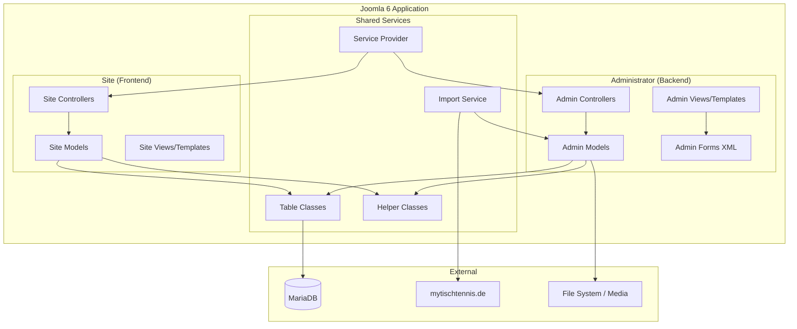
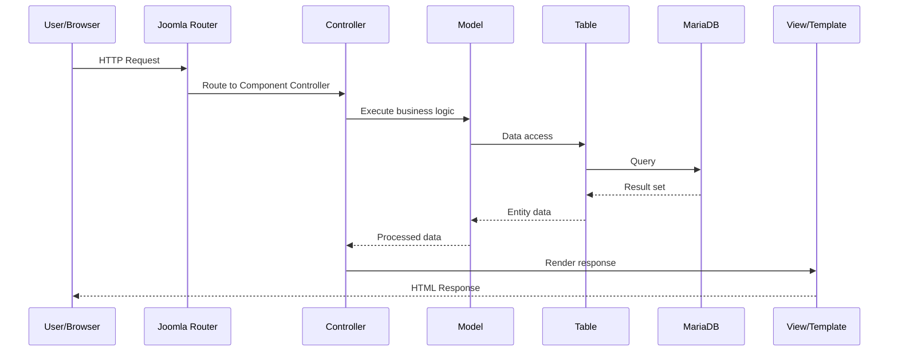
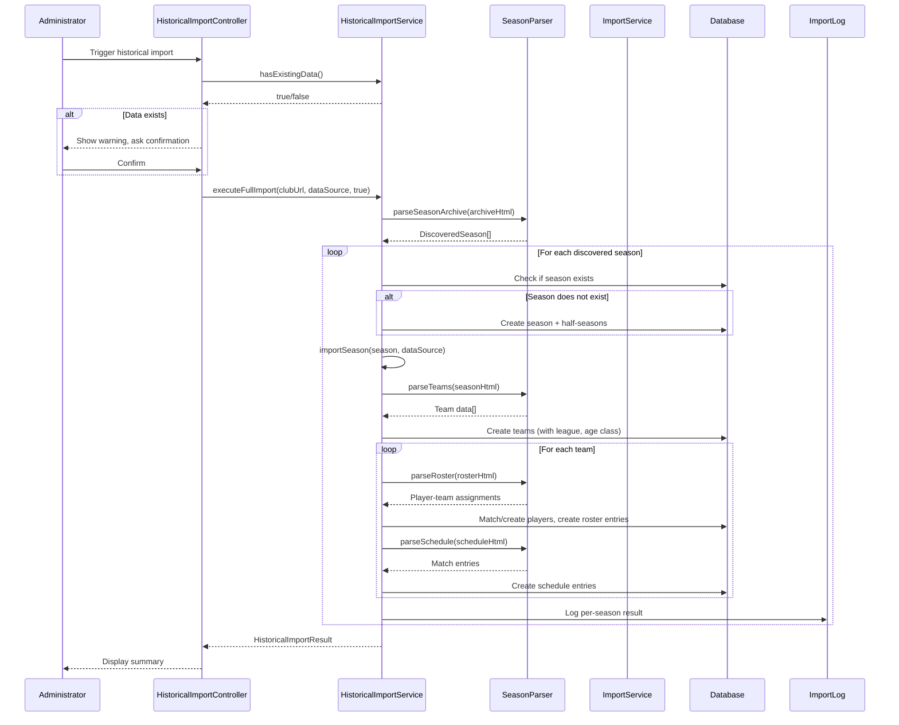

# Design Document

## Overview

The Table Tennis Club Manager (`com_ttclub`) is a Joomla 6 component that provides a complete management solution for table tennis clubs. It follows Joomla's MVC architecture with separate administrator (backend) and site (frontend) sections.

The component manages five core entities: Players, Teams, Leagues, Seasons (with half-seasons), and Schedules. Team rosters are the key association binding players to teams per half-season, enabling roster changes between halves. A data import subsystem scrapes mytischtennis.de for player, roster, and schedule data.

**Key design decisions:**
- Component name: `com_ttclub` (short, Joomla convention-compliant)
- Vendor namespace: `Fatherjoe\Component\Ttclub`
- Database engine: MariaDB with Joomla's database abstraction layer
- PHP 8.4+ with strict typing throughout
- PSR-4 autoloading for all classes
- Joomla's native form framework for validation and CSRF protection
- Image storage in Joomla's media folder with half-season associations

## Architecture

### High-Level Architecture



### Component Directory Structure

```
com_ttclub/
├── administrator/
│   ├── forms/                    # XML form definitions
│   │   ├── player.xml
│   │   ├── team.xml
│   │   ├── league.xml
│   │   ├── season.xml
│   │   ├── schedule.xml
│   │   ├── roster.xml
│   │   ├── ageclass.xml
│   │   └── import.xml
│   ├── services/
│   │   └── provider.php          # DI service provider
│   ├── sql/
│   │   ├── install.sql           # Initial schema
│   │   ├── uninstall.sql         # Cleanup
│   │   └── updates/              # Versioned schema updates
│   │       └── mariadb/
│   ├── src/
│   │   ├── Controller/
│   │   │   ├── DisplayController.php
│   │   │   ├── PlayerController.php
│   │   │   ├── PlayersController.php
│   │   │   ├── TeamController.php
│   │   │   ├── TeamsController.php
│   │   │   ├── LeagueController.php
│   │   │   ├── LeaguesController.php
│   │   │   ├── SeasonController.php
│   │   │   ├── SeasonsController.php
│   │   │   ├── ScheduleController.php
│   │   │   ├── SchedulesController.php
│   │   │   ├── RosterController.php
│   │   │   ├── AgeclassController.php
│   │   │   ├── AgeclassesController.php
│   │   │   └── ImportController.php
│   │   ├── Extension/
│   │   │   └── TtclubComponent.php
│   │   ├── Helper/
│   │   │   └── TtclubHelper.php
│   │   ├── Model/
│   │   │   ├── PlayerModel.php
│   │   │   ├── PlayersModel.php
│   │   │   ├── TeamModel.php
│   │   │   ├── TeamsModel.php
│   │   │   ├── LeagueModel.php
│   │   │   ├── LeaguesModel.php
│   │   │   ├── SeasonModel.php
│   │   │   ├── SeasonsModel.php
│   │   │   ├── ScheduleModel.php
│   │   │   ├── SchedulesModel.php
│   │   │   ├── RosterModel.php
│   │   │   ├── AgeclassModel.php
│   │   │   ├── AgeclassesModel.php
│   │   │   └── ImportModel.php
│   │   ├── Service/
│   │   │   └── ImportService.php
│   │   ├── Table/
│   │   │   ├── PlayerTable.php
│   │   │   ├── TeamTable.php
│   │   │   ├── LeagueTable.php
│   │   │   ├── SeasonTable.php
│   │   │   ├── HalfSeasonTable.php
│   │   │   ├── RosterTable.php
│   │   │   ├── ScheduleTable.php
│   │   │   ├── AgeclassTable.php
│   │   │   └── ImportLogTable.php
│   │   └── View/
│   │       ├── Players/     HtmlView.php
│   │       ├── Player/      HtmlView.php
│   │       ├── Teams/       HtmlView.php
│   │       ├── Team/        HtmlView.php
│   │       ├── Leagues/     HtmlView.php
│   │       ├── League/      HtmlView.php
│   │       ├── Seasons/     HtmlView.php
│   │       ├── Season/      HtmlView.php
│   │       ├── Schedules/   HtmlView.php
│   │       ├── Schedule/    HtmlView.php
│   │       ├── Ageclasses/  HtmlView.php
│   │       ├── Ageclass/    HtmlView.php
│   │       ├── Roster/      HtmlView.php
│   │       └── Import/      HtmlView.php
│   └── tmpl/                     # Admin view templates
│       ├── players/
│       ├── player/
│       ├── teams/
│       ├── team/
│       ├── leagues/
│       ├── league/
│       ├── seasons/
│       ├── season/
│       ├── schedules/
│       ├── schedule/
│       ├── ageclasses/
│       ├── ageclass/
│       ├── roster/
│       └── import/
├── site/
│   ├── src/
│   │   ├── Controller/
│   │   │   └── DisplayController.php
│   │   ├── Model/
│   │   │   ├── PlayersModel.php
│   │   │   ├── PlayerModel.php
│   │   │   ├── TeamsModel.php
│   │   │   ├── TeamModel.php
│   │   │   └── ScheduleModel.php
│   │   └── View/
│   │       ├── Players/     HtmlView.php
│   │       ├── Player/      HtmlView.php
│   │       ├── Teams/       HtmlView.php
│   │       ├── Team/        HtmlView.php
│   │       └── Schedule/    HtmlView.php
│   └── tmpl/
│       ├── players/
│       ├── player/
│       ├── teams/
│       ├── team/
│       └── schedule/
├── media/
│   └── com_ttclub/
│       ├── css/
│       ├── js/
│       └── images/
│           └── placeholder.png
└── ttclub.xml                    # Installation manifest
```

### Request Flow



## Components and Interfaces

### Service Provider

The component registers with Joomla's DI container via `administrator/services/provider.php`:

```php
<?php
declare(strict_types=1);

use Joomla\CMS\Dispatcher\ComponentDispatcherFactoryInterface;
use Joomla\CMS\Extension\ComponentInterface;
use Joomla\CMS\Extension\Service\Provider\ComponentDispatcherFactory;
use Joomla\CMS\Extension\Service\Provider\MVCFactory;
use Joomla\CMS\MVC\Factory\MVCFactoryInterface;
use Joomla\DI\Container;
use Joomla\DI\ServiceProviderInterface;
use Fatherjoe\Component\Ttclub\Administrator\Extension\TtclubComponent;

return new class implements ServiceProviderInterface {
    public function register(Container $container): void
    {
        $container->registerServiceProvider(new MVCFactory('\\Fatherjoe\\Component\\Ttclub'));
        $container->registerServiceProvider(new ComponentDispatcherFactory('\\Fatherjoe\\Component\\Ttclub'));

        $container->set(
            ComponentInterface::class,
            function (Container $container): TtclubComponent {
                $component = new TtclubComponent($container->get(ComponentDispatcherFactoryInterface::class));
                $component->setMVCFactory($container->get(MVCFactoryInterface::class));
                return $component;
            }
        );
    }
};
```

### TtclubComponent Extension Class

```php
<?php
declare(strict_types=1);

namespace Fatherjoe\Component\Ttclub\Administrator\Extension;

use Joomla\CMS\Extension\MVCComponent;
use Joomla\CMS\Extension\BootableExtensionInterface;
use Joomla\CMS\Component\Router\RouterServiceInterface;
use Joomla\CMS\Component\Router\RouterServiceTrait;

class TtclubComponent extends MVCComponent implements
    BootableExtensionInterface,
    RouterServiceInterface
{
    use RouterServiceTrait;

    public function boot(\Psr\Container\ContainerInterface $container): void
    {
        // Component bootstrap logic
    }
}
```

### Key Interfaces

| Interface | Purpose |
|-----------|---------|
| `ComponentInterface` | Main component registration with Joomla |
| `MVCFactoryInterface` | Creates MVC objects (Models, Views, Controllers, Tables) |
| `FormFactoryInterface` | Creates form objects for validation |
| `RouterServiceInterface` | SEF URL routing for frontend |
| `BootableExtensionInterface` | Component initialization hook |

### Controller Layer

**Singular controllers** (e.g., `PlayerController`) handle single-record CRUD (save, delete, cancel). They extend `Joomla\CMS\MVC\Controller\FormController`.

**Plural controllers** (e.g., `PlayersController`) handle list operations (publish, unpublish, ordering, batch). They extend `Joomla\CMS\MVC\Controller\AdminController`.

**Special controllers:**
- `ImportController` — orchestrates the import workflow from mytischtennis.de
- `RosterController` — handles roster assignment/removal and copy operations

### Model Layer

**List models** (e.g., `PlayersModel`) extend `Joomla\CMS\MVC\Model\ListModel`:
- Provide paginated, sortable, filterable lists
- Implement `getListQuery()` for database queries
- Support search/filter state via user state

**Item models** (e.g., `PlayerModel`) extend `Joomla\CMS\MVC\Model\AdminModel`:
- Handle single-record load, validate, save
- Implement `getForm()` to return Joomla Form objects
- Enforce business rules in `save()` override

**Site models** extend `Joomla\CMS\MVC\Model\BaseDatabaseModel` or `ListModel`:
- Read-only access for public display
- Include half-season resolution logic

### Import Service

```php
<?php
declare(strict_types=1);

namespace Fatherjoe\Component\Ttclub\Administrator\Service;

class ImportService
{
    public function importPlayers(string $clubUrl, int $seasonId): ImportResult;
    public function importRosters(string $clubUrl, int $seasonId, int $halfSeasonId): ImportResult;
    public function importSchedules(string $clubUrl, int $seasonId): ImportResult;
    public function validateClubConnection(string $clubIdentifier): bool;
}
```

The `ImportService` uses PHP's built-in HTTP client (or Joomla's `HttpFactory`) to fetch pages from mytischtennis.de, parses HTML using DOMDocument/DOMXPath, and maps extracted data to component entities.

### Historical Import Service

```php
<?php
declare(strict_types=1);

namespace Fatherjoe\Component\Ttclub\Administrator\Service;

use Fatherjoe\Component\Ttclub\Administrator\Service\ImportService;

/**
 * Handles one-time bulk import of all historical seasons from mytischtennis.de or click-tt.de.
 * Recursively discovers and imports all available seasons for a configured club.
 */
class HistoricalImportService
{
    private ImportService $importService;
    private HttpClientInterface $httpClient;
    private SeasonParserInterface $seasonParser;

    public function __construct(
        ImportService $importService,
        HttpClientInterface $httpClient,
        SeasonParserInterface $seasonParser
    ) {
        $this->importService = $importService;
        $this->httpClient = $httpClient;
        $this->seasonParser = $seasonParser;
    }

    /**
     * Discover all available seasons from the club's archive pages.
     * Recursively navigates season archive to find all historical season URLs.
     *
     * @param string $clubUrl Base club URL on mytischtennis.de or click-tt.de
     * @param string $dataSource 'mytischtennis' or 'clicktt'
     * @return DiscoveredSeason[] Array of discovered season descriptors
     */
    public function discoverSeasons(string $clubUrl, string $dataSource): array;

    /**
     * Execute the full historical import for all discovered seasons.
     * Creates seasons, teams, rosters, schedules, and players as needed.
     *
     * @param string $clubUrl Base club URL
     * @param string $dataSource 'mytischtennis' or 'clicktt'
     * @param bool $confirmed Whether the admin has confirmed the operation
     * @return HistoricalImportResult Summary of all created records
     * @throws HistoricalImportException On connection or parsing failures
     */
    public function executeFullImport(
        string $clubUrl,
        string $dataSource,
        bool $confirmed = false
    ): HistoricalImportResult;

    /**
     * Check whether the database already contains data (seasons or teams).
     * Used to trigger the "initial setup" warning before proceeding.
     */
    public function hasExistingData(): bool;

    /**
     * Import a single season's data (teams, rosters, schedules).
     * Called internally by executeFullImport for each discovered season.
     *
     * @param DiscoveredSeason $season The season to import
     * @param string $dataSource 'mytischtennis' or 'clicktt'
     * @return SeasonImportResult Per-season result with counts
     */
    public function importSeason(DiscoveredSeason $season, string $dataSource): SeasonImportResult;
}
```

#### Supporting Data Transfer Objects

```php
<?php
declare(strict_types=1);

namespace Fatherjoe\Component\Ttclub\Administrator\Service;

class DiscoveredSeason
{
    public function __construct(
        public readonly string $name,        // e.g. "2019/20"
        public readonly string $archiveUrl,  // URL to the season page
        public readonly string $dataSource   // 'mytischtennis' or 'clicktt'
    ) {}
}

class SeasonImportResult
{
    public function __construct(
        public readonly string $seasonName,
        public readonly int $teamsCreated,
        public readonly int $rosterEntriesCreated,
        public readonly int $scheduleEntriesCreated,
        public readonly int $playersCreated,
        public readonly bool $success,
        public readonly ?string $errorMessage = null
    ) {}
}

class HistoricalImportResult
{
    public function __construct(
        public readonly int $seasonsCreated,
        public readonly int $teamsCreated,
        public readonly int $playersCreated,
        public readonly int $rosterEntriesCreated,
        public readonly int $scheduleEntriesCreated,
        /** @var SeasonImportResult[] */
        public readonly array $perSeasonResults = []
    ) {}
}
```

#### Season Parser Interface

Different HTML structures exist on mytischtennis.de vs click-tt.de. The parser interface abstracts this:

```php
<?php
declare(strict_types=1);

namespace Fatherjoe\Component\Ttclub\Administrator\Service;

interface SeasonParserInterface
{
    /**
     * Parse season archive HTML to discover available season links.
     */
    public function parseSeasonArchive(string $html): array;

    /**
     * Parse a season page to extract team listings.
     */
    public function parseTeams(string $html): array;

    /**
     * Parse a team roster page to extract player assignments per half-season.
     */
    public function parseRoster(string $html): array;

    /**
     * Parse a schedule page to extract match entries.
     */
    public function parseSchedule(string $html): array;
}
```

Two implementations: `MyTischtennisParser` and `ClickTtParser`, selected based on the administrator's data source choice.

#### Import Flow



### Table Layer

Table classes extend `Joomla\CMS\Table\Table` and provide:
- Column-to-property mapping
- `check()` method for pre-save validation
- `delete()` override for referential integrity checks (e.g., prevent deleting a player assigned to a roster)
- `store()` override for unique constraint enforcement


## Data Models

### Entity-Relationship Diagram

```mermaid
erDiagram
    PLAYER {
        int id PK
        varchar first_name
        varchar last_name
        tinyint published
        datetime created
        datetime modified
    }
    
    PLAYER_IMAGE {
        int id PK
        int player_id FK
        int half_season_id FK
        varchar image_path
        datetime created
    }
    
    TEAM {
        int id PK
        int season_id FK
        int league_id FK
        int age_class_id FK
        int team_number
        tinyint published
        datetime created
        datetime modified
    }
    
    TEAM_PHOTO {
        int id PK
        int team_id FK
        int half_season_id FK
        varchar image_path
        datetime created
    }
    
    LEAGUE {
        int id PK
        varchar name
        tinyint published
        datetime created
        datetime modified
    }
    
    AGE_CLASS {
        int id PK
        varchar name
        int max_age
        tinyint published
        datetime created
        datetime modified
    }
    
    SEASON {
        int id PK
        varchar name
        tinyint published
        datetime created
        datetime modified
    }
    
    HALF_SEASON {
        int id PK
        int season_id FK
        tinyint half "1=first, 2=second"
        date start_date
        date end_date
    }
    
    ROSTER {
        int id PK
        int player_id FK
        int team_id FK
        int half_season_id FK
        datetime created
    }
    
    SCHEDULE {
        int id PK
        int team_id FK
        int season_id FK
        date match_date
        time match_time
        varchar opponent
        varchar venue
        tinyint home_away "1=home, 2=away"
        varchar result
        tinyint published
        datetime created
        datetime modified
    }
    
    IMPORT_LOG {
        int id PK
        datetime import_date
        varchar import_type
        int records_created
        int records_updated
        int records_unchanged
        tinyint status
        text message
    }
    
    PLAYER ||--o{ PLAYER_IMAGE : "has images"
    PLAYER ||--o{ ROSTER : "assigned to"
    TEAM ||--o{ ROSTER : "contains"
    TEAM ||--o{ TEAM_PHOTO : "has photos"
    TEAM ||--o{ SCHEDULE : "has matches"
    TEAM }o--|| LEAGUE : "plays in"
    TEAM }o--|| SEASON : "competes in"
    TEAM }o--|| AGE_CLASS : "classified as"
    SEASON ||--|| HALF_SEASON : "first half"
    SEASON ||--|| HALF_SEASON : "second half"
    HALF_SEASON ||--o{ ROSTER : "during"
    HALF_SEASON ||--o{ PLAYER_IMAGE : "for period"
    HALF_SEASON ||--o{ TEAM_PHOTO : "for period"
```



### Database Schema (MariaDB)

All tables use the `#__ttclub_` prefix (Joomla convention with configurable table prefix).

#### `#__ttclub_players`

| Column | Type | Constraints |
|--------|------|-------------|
| id | INT UNSIGNED | PK, AUTO_INCREMENT |
| first_name | VARCHAR(50) | NOT NULL |
| last_name | VARCHAR(50) | NOT NULL |
| published | TINYINT(1) | NOT NULL DEFAULT 1 |
| created | DATETIME | NOT NULL |
| modified | DATETIME | NOT NULL |
| created_by | INT UNSIGNED | NOT NULL DEFAULT 0 |
| modified_by | INT UNSIGNED | NOT NULL DEFAULT 0 |

Index: `idx_last_name` on `last_name` for search/filter.

#### `#__ttclub_player_images`

| Column | Type | Constraints |
|--------|------|-------------|
| id | INT UNSIGNED | PK, AUTO_INCREMENT |
| player_id | INT UNSIGNED | NOT NULL, FK → players.id |
| half_season_id | INT UNSIGNED | NOT NULL, FK → half_seasons.id |
| image_path | VARCHAR(255) | NOT NULL |
| created | DATETIME | NOT NULL |

Unique: `uix_player_half_season` on (`player_id`, `half_season_id`).

#### `#__ttclub_teams`

| Column | Type | Constraints |
|--------|------|-------------|
| id | INT UNSIGNED | PK, AUTO_INCREMENT |
| season_id | INT UNSIGNED | NOT NULL, FK → seasons.id |
| league_id | INT UNSIGNED | NOT NULL, FK → leagues.id |
| age_class_id | INT UNSIGNED | NOT NULL, FK → age_classes.id |
| team_number | INT UNSIGNED | NOT NULL |
| published | TINYINT(1) | NOT NULL DEFAULT 1 |
| created | DATETIME | NOT NULL |
| modified | DATETIME | NOT NULL |
| created_by | INT UNSIGNED | NOT NULL DEFAULT 0 |
| modified_by | INT UNSIGNED | NOT NULL DEFAULT 0 |

Index: `idx_season` on `season_id`.

#### `#__ttclub_team_photos`

| Column | Type | Constraints |
|--------|------|-------------|
| id | INT UNSIGNED | PK, AUTO_INCREMENT |
| team_id | INT UNSIGNED | NOT NULL, FK → teams.id |
| half_season_id | INT UNSIGNED | NOT NULL, FK → half_seasons.id |
| image_path | VARCHAR(255) | NOT NULL |
| created | DATETIME | NOT NULL |

Unique: `uix_team_half_season` on (`team_id`, `half_season_id`).

#### `#__ttclub_leagues`

| Column | Type | Constraints |
|--------|------|-------------|
| id | INT UNSIGNED | PK, AUTO_INCREMENT |
| name | VARCHAR(100) | NOT NULL, UNIQUE |
| published | TINYINT(1) | NOT NULL DEFAULT 1 |
| created | DATETIME | NOT NULL |
| modified | DATETIME | NOT NULL |
| created_by | INT UNSIGNED | NOT NULL DEFAULT 0 |
| modified_by | INT UNSIGNED | NOT NULL DEFAULT 0 |

#### `#__ttclub_age_classes`

| Column | Type | Constraints |
|--------|------|-------------|
| id | INT UNSIGNED | PK, AUTO_INCREMENT |
| name | VARCHAR(100) | NOT NULL |
| max_age | INT UNSIGNED | NULL (NULL = open/no age limit) |
| published | TINYINT(1) | NOT NULL DEFAULT 1 |
| created | DATETIME | NOT NULL |
| modified | DATETIME | NOT NULL |

#### `#__ttclub_seasons`

| Column | Type | Constraints |
|--------|------|-------------|
| id | INT UNSIGNED | PK, AUTO_INCREMENT |
| name | VARCHAR(10) | NOT NULL (format: "YYYY/YY") |
| published | TINYINT(1) | NOT NULL DEFAULT 1 |
| created | DATETIME | NOT NULL |
| modified | DATETIME | NOT NULL |
| created_by | INT UNSIGNED | NOT NULL DEFAULT 0 |
| modified_by | INT UNSIGNED | NOT NULL DEFAULT 0 |

#### `#__ttclub_half_seasons`

| Column | Type | Constraints |
|--------|------|-------------|
| id | INT UNSIGNED | PK, AUTO_INCREMENT |
| season_id | INT UNSIGNED | NOT NULL, FK → seasons.id |
| half | TINYINT(1) | NOT NULL (1=first, 2=second) |
| start_date | DATE | NOT NULL |
| end_date | DATE | NOT NULL |

Unique: `uix_season_half` on (`season_id`, `half`).
Constraint: Exactly 2 rows per season_id (enforced at application level).

#### `#__ttclub_rosters`

| Column | Type | Constraints |
|--------|------|-------------|
| id | INT UNSIGNED | PK, AUTO_INCREMENT |
| player_id | INT UNSIGNED | NOT NULL, FK → players.id |
| team_id | INT UNSIGNED | NOT NULL, FK → teams.id |
| half_season_id | INT UNSIGNED | NOT NULL, FK → half_seasons.id |
| created | DATETIME | NOT NULL |

Unique: `uix_player_team_halfseason` on (`player_id`, `team_id`, `half_season_id`).
Index: `idx_team_halfseason` on (`team_id`, `half_season_id`) for roster lookups.

#### `#__ttclub_schedules`

| Column | Type | Constraints |
|--------|------|-------------|
| id | INT UNSIGNED | PK, AUTO_INCREMENT |
| team_id | INT UNSIGNED | NOT NULL, FK → teams.id |
| season_id | INT UNSIGNED | NOT NULL, FK → seasons.id |
| match_date | DATE | NOT NULL |
| match_time | TIME | NULL |
| opponent | VARCHAR(150) | NOT NULL |
| venue | VARCHAR(200) | NOT NULL |
| home_away | TINYINT(1) | NOT NULL (1=home, 2=away) |
| result | VARCHAR(20) | NULL |
| published | TINYINT(1) | NOT NULL DEFAULT 1 |
| created | DATETIME | NOT NULL |
| modified | DATETIME | NOT NULL |
| created_by | INT UNSIGNED | NOT NULL DEFAULT 0 |
| modified_by | INT UNSIGNED | NOT NULL DEFAULT 0 |

Index: `idx_team_season_date` on (`team_id`, `season_id`, `match_date`).

#### `#__ttclub_import_logs`

| Column | Type | Constraints |
|--------|------|-------------|
| id | INT UNSIGNED | PK, AUTO_INCREMENT |
| import_date | DATETIME | NOT NULL |
| import_type | VARCHAR(50) | NOT NULL |
| records_created | INT UNSIGNED | NOT NULL DEFAULT 0 |
| records_updated | INT UNSIGNED | NOT NULL DEFAULT 0 |
| records_unchanged | INT UNSIGNED | NOT NULL DEFAULT 0 |
| status | TINYINT(1) | NOT NULL (1=success, 0=failure) |
| message | TEXT | NULL |

### Component Configuration (stored via Joomla's `#__extensions` params)

```json
{
    "mytischtennis_club_id": "",
    "mytischtennis_club_url": "",
    "player_visible_fields": ["first_name", "last_name"],
    "default_placeholder_image": "media/com_ttclub/images/placeholder.png"
}
```

### Half-Season Resolution Logic

The current half-season is determined by:
1. Find the half-season whose `start_date <= TODAY` AND `end_date >= TODAY`
2. If none found, select the half-season with the most recent `end_date` that is in the past

This logic is encapsulated in a shared helper method used by both admin and site models.


## Correctness Properties

*A property is a characteristic or behavior that should hold true across all valid executions of a system—essentially, a formal statement about what the system should do. Properties serve as the bridge between human-readable specifications and machine-verifiable correctness guarantees.*

### Property 1: Player data round-trip

*For any* valid player data (first name 1–50 chars, last name 1–50 chars), saving the player and then loading it by ID should return a record with identical first name and last name values.

**Validates: Requirements 1.1, 1.3**

### Property 2: Player name validation rejects invalid input

*For any* player form submission where first name or last name is empty (including whitespace-only strings) or exceeds 50 characters, the component should reject the submission and identify which fields are invalid.

**Validates: Requirements 1.5**

### Property 3: Player deletion is prevented iff roster assignments exist

*For any* player, deletion succeeds if and only if the player has zero roster assignments. If one or more roster assignments exist, deletion must be prevented.

**Validates: Requirements 1.6, 1.7**

### Property 4: Player search returns correct subset

*For any* set of players and any non-empty search string, filtering the player list by last name should return exactly the players whose last name contains the search string (case-insensitive), and no others.

**Validates: Requirements 1.10**

### Property 5: Team required field validation

*For any* team form submission missing one or more of the required fields (season, league, age class, team number), the component should reject the submission and identify all missing fields.

**Validates: Requirements 2.5, 2.7, 2.11**

### Property 6: Team deletion is prevented iff roster assignments exist

*For any* team, deletion succeeds if and only if the team has zero roster entries. If roster entries exist, deletion must be prevented.

**Validates: Requirements 2.6**

### Property 7: Team league immutability

*For any* existing team record, any attempt to change the league_id field should be rejected by validation. The league value at creation time must remain fixed for the lifetime of the record.

**Validates: Requirements 2.8**

### Property 8: Age class deletion is prevented iff teams reference it

*For any* age class, deletion succeeds if and only if zero teams reference that age class.

**Validates: Requirements 2.13**

### Property 9: League name uniqueness

*For any* league name that already exists in the database, attempting to create or rename another league to that same name (case-insensitive) must be rejected.

**Validates: Requirements 3.7**

### Property 10: League deletion is prevented iff teams reference it

*For any* league, deletion succeeds if and only if zero teams reference that league.

**Validates: Requirements 3.6**

### Property 11: Season half-season date ordering

*For any* season form submission where the first half end date is on or after the second half start date, the component must reject the submission. Valid seasons require first_half.end_date < second_half.start_date.

**Validates: Requirements 4.8**

### Property 12: Season structure invariant

*For any* season in the database, exactly two half-season records must exist: one with half=1 and one with half=2.

**Validates: Requirements 4.7**

### Property 13: Half-season resolution

*For any* reference date and any set of half-seasons, the resolution algorithm must select: (a) the half-season whose start_date ≤ reference_date ≤ end_date if one exists, or (b) the half-season with the most recent end_date before the reference date if none contains it.

**Validates: Requirements 4.9, 4.10, 8.7, 9.2**

### Property 14: Season deletion is prevented iff associated data exists

*For any* season, deletion succeeds if and only if no roster entries and no schedule entries reference that season (directly or via its half-seasons).

**Validates: Requirements 4.6**

### Property 15: Roster duplicate rejection

*For any* existing roster entry (player_id, team_id, half_season_id), attempting to create another entry with the same three values must be rejected.

**Validates: Requirements 5.9**

### Property 16: Roster copy produces identical assignments

*For any* roster (set of player assignments for a team in a half-season), copying to the next half-season must produce a set of roster entries in the target half-season with the same set of player IDs.

**Validates: Requirements 5.7**

### Property 17: Schedule ordering (ascending by date)

*For any* team and season, the schedule list must be returned with entries sorted by match_date in ascending order.

**Validates: Requirements 6.2, 10.2**

### Property 18: Frontend schedule grouping

*For any* set of schedule entries and a reference date, the frontend display must group entries into "upcoming" (match_date ≥ reference_date, sorted ascending) followed by "past" (match_date < reference_date, sorted descending by date).

**Validates: Requirements 10.3**

### Property 19: Frontend schedule entry completeness

*For any* schedule entry rendered in the frontend, the output must contain the date, time, opponent name, venue, and home/away indicator. If a result exists, it must also be displayed.

**Validates: Requirements 10.4, 10.5**

### Property 20: Frontend team ordering

*For any* set of teams displayed on the teams overview page, the order must be by team_number in ascending order.

**Validates: Requirements 9.1**

### Property 21: Frontend player visibility filtering

*For any* player and any administrator-configured visibility setting, the frontend display must only show fields that are designated as publicly visible. No non-visible field value must appear in the frontend output.

**Validates: Requirements 8.3**

### Property 22: Frontend player ordering

*For any* set of players displayed on the players overview page, the order must be alphabetical by last name.

**Validates: Requirements 8.1**

### Property 23: Import player matching by name

*For any* imported player record with (first_name, last_name) matching an existing player, the import must update the existing record rather than creating a duplicate.

**Validates: Requirements 7.11**

### Property 24: Import audit logging

*For any* import operation (regardless of success or failure), an import_log record must be created with a timestamp, the import type, and the result counts.

**Validates: Requirements 7.9**

### Property 25: Import summary arithmetic

*For any* successful import operation, the sum of records_created + records_updated + records_unchanged must equal the total number of records processed from the source.

**Validates: Requirements 7.4**

### Property 26: ACL enforcement

*For any* backend CRUD operation and any user lacking the required Joomla ACL permission (core.create, core.edit, core.delete, core.edit.state, core.manage), the operation must be denied. Users with core.admin must be granted access to all operations.

**Validates: Requirements 12.1, 12.2**

### Property 27: Season discovery completeness

*For any* HTML page representing a season archive (with any number of season links embedded), the season parser must discover and return exactly the set of season URLs present in the archive page, with no omissions and no fabricated entries.

**Validates: Requirements 13.1**

### Property 28: Season deduplication on import

*For any* set of discovered season names and any set of seasons already existing in the database, the historical import must create season records only for discovered seasons whose name does not match any existing season. The count of newly created seasons must equal the number of discovered seasons minus those already present.

**Validates: Requirements 13.2**

### Property 29: Team data extraction completeness

*For any* HTML page representing a season's team listing, the parser must extract all team entries with their team number, league name, and age class. The number of extracted teams must equal the number of team entries in the source HTML.

**Validates: Requirements 13.3**

### Property 30: Roster entry creation from scraped data

*For any* parsed roster page containing player-to-team assignments for a given half-season, the historical import must create exactly one roster entry per (player, team, half-season) combination found in the source. No duplicates and no omissions.

**Validates: Requirements 13.4**

### Property 31: Schedule entry completeness from scraped data

*For any* parsed schedule page, every extracted match entry must contain a non-null date, opponent name, venue, and home/away indicator. The number of schedule entries created must equal the number of match entries in the source HTML.

**Validates: Requirements 13.5**

### Property 32: Historical import player match-or-create

*For any* set of player names encountered during a historical import and any set of existing players in the database, the import must: (a) reuse existing player records when a first_name + last_name match is found, and (b) create a new player record only when no match exists. The total player count in the database after import must equal the count of unique (first_name, last_name) pairs across both existing and imported sets.

**Validates: Requirements 13.6, 13.11**

### Property 33: Historical import summary accuracy

*For any* historical import operation that completes successfully, the reported summary counts (seasons_created, teams_created, players_created, roster_entries_created, schedule_entries_created) must each equal the actual number of records created in the corresponding database tables during that operation.

**Validates: Requirements 13.7**

### Property 34: Historical import per-season audit logging

*For any* historical import operation processing N discovered seasons, exactly N import log entries must be created, each with a non-null timestamp, the correct season identifier, and a status reflecting whether that season's import succeeded or failed.

**Validates: Requirements 13.10**

## Error Handling

### Validation Errors

| Context | Behavior |
|---------|----------|
| Missing required fields | Form redisplays with field-specific error messages via Joomla's `enqueueMessage()` |
| Invalid data format (e.g., season name not "YYYY/YY") | Validation error with descriptive message |
| Referential integrity violation on delete | Operation blocked, error message identifies the dependency |
| Duplicate unique values (league name, roster entry) | Rejection with message identifying the conflict |
| Image upload exceeds size limit | Upload rejected with file size message |
| Image wrong format (not JPEG/PNG) | Upload rejected with allowed format message |
| League change on existing team | Save rejected with immutability message |

### Import Errors

| Context | Behavior |
|---------|----------|
| Connection failure to mytischtennis.de | Error message displayed, existing data unchanged, failure logged |
| Invalid/unparseable response | Error message displayed, data unchanged, failure logged |
| Partial import failure (one type fails) | Entire selected operation marked incomplete, successfully imported types still persisted for roster imports |
| Data conflict with existing records | Administrator prompted for review; no automatic overwrite |
| Invalid club identifier | Validation check fails with descriptive error |

### Historical Import Errors

| Context | Behavior |
|---------|----------|
| Connection failure on specific season page | Error message identifies the failing season/page, existing data unchanged, per-season failure logged |
| Invalid/unparseable archive page | Error message displayed, no seasons discovered, failure logged |
| Failure mid-import (after some seasons imported) | Already-imported seasons remain (committed per-season), failure identifies which season failed |
| Existing data warning dismissed | Import proceeds only with explicit admin confirmation |
| Unsupported data source selected | Validation error indicating only mytischtennis.de and click-tt.de are supported |
| Player name parsing failure (malformed HTML) | Player skipped, logged as warning, import continues for remaining entries |

### General Error Handling

- All database operations wrapped in try/catch with Joomla's logging
- CSRF token validation on every form POST; failure returns 403
- ACL check failure redirects to admin dashboard with "access denied" message
- File system errors during image upload produce user-friendly messages without exposing paths
- Frontend model errors display generic "data could not be retrieved" messages

## Testing Strategy

### Unit Testing (PHPUnit)

Unit tests focus on specific examples and edge cases:

- **Validation logic**: Test each entity's form validation with specific valid/invalid inputs
- **Table class methods**: Test `check()` and `delete()` overrides with concrete scenarios
- **Helper methods**: Test half-season resolution with specific date configurations
- **Import parsing**: Test HTML parsing with sample mytischtennis.de responses (mocked)
- **ACL checks**: Test permission enforcement with specific user/permission combinations

### Property-Based Testing (PHPUnit with `eris/eris`)

Property tests verify universal correctness properties across generated inputs. The library [eris/eris](https://github.com/giorgiosironi/eris) provides property-based testing for PHP/PHPUnit.

**Configuration:**
- Minimum 100 iterations per property test
- Each test tagged with the design property it validates

**Properties to implement:**

| Property | Generator Strategy |
|----------|-------------------|
| P1: Player round-trip | Random strings 1–50 chars for names |
| P2: Player validation | Empty strings, whitespace strings, strings >50 chars |
| P3: Player delete guard | Random players with/without roster entries |
| P4: Player search | Random player sets + random search substrings |
| P5: Team validation | Random combinations of missing/present fields |
| P7: League immutability | Random teams with attempted league changes |
| P9: League uniqueness | Random league names, duplicates |
| P11: Date ordering | Random date pairs with first_end >= second_start |
| P12: Season structure | Random seasons, verify half-season count |
| P13: Half-season resolution | Random half-season date ranges + reference dates |
| P15: Roster duplicate | Random existing rosters + duplicate attempts |
| P16: Roster copy | Random rosters, verify copy completeness |
| P17: Schedule ordering | Random schedule sets, verify sort order |
| P18: Schedule grouping | Random schedule dates + reference date, verify grouping |
| P19: Schedule completeness | Random schedule entries, verify all fields in output |
| P20: Team ordering | Random team sets, verify team_number order |
| P21: Visibility filter | Random fields + visibility configs, verify filtering |
| P22: Player ordering | Random player sets, verify alphabetical order |
| P23: Import matching | Random player names, verify match logic |
| P25: Import arithmetic | Random import counts, verify sum |
| P26: ACL enforcement | Random operations + permission sets, verify access |

### Integration Testing

- Import service with mocked HTTP responses (complete page fixtures from mytischtennis.de)
- Full CRUD workflows through controller layer with database
- Menu item registration and routing
- Image upload/storage/retrieval workflow
- Roster copy across half-seasons with merge/replace scenarios

### Smoke Testing

- Component installation via manifest XML
- Service provider registration
- Admin menu items accessible
- Frontend views render without errors
- CSRF tokens present in all forms
- Database tables created with correct structure

### Test Execution

```bash
# Run all tests
vendor/bin/phpunit --configuration phpunit.xml

# Run property tests only
vendor/bin/phpunit --group property

# Run integration tests only  
vendor/bin/phpunit --group integration
```
